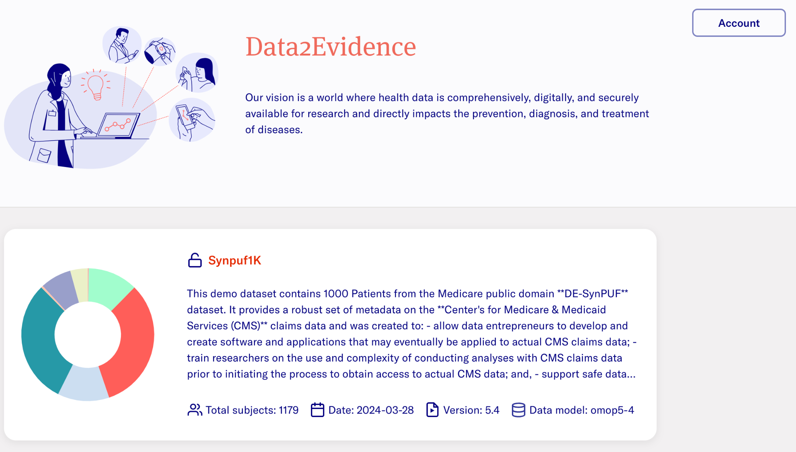
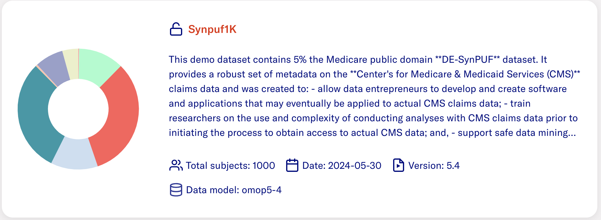

# User Interface

After signing in, you see the dataset list page. Here, you can find:

- Publicly available datasets for everyone

- Private datasets to which you have been granted access

### Dataset card

The dataset card here provides concise information about the dataset:

- Dataset name

- Short description

- More details like CDM version, patient count, and create or update
    date

Click the card to proceed to the dataset page to perform further
actions.

### Navigation bar

The navigation bar on top has multiple options:

- **Dataset name dropdown:** See the currently active dataset or use
    the dropdown to select another dataset

- **Dataset**: See current dataset information.

- **Concepts:** See the various concept sets available for the
    datasets or create a new concept set.

- **Cohort:** View the list of cohorts and access the cohort browser.

- **Notebooks:** Start the interactive notebook function.

- **Analysis:** Access pre-configured analysis pipelines

- **Account:** View your account details, change your password, read
    the legal documents, and sign out.

To go back to the dataset list page, click the Data2Evidence logo or the
back arrow icon in the navigation bar.
