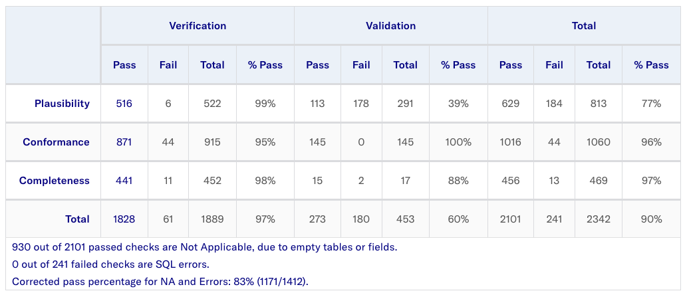
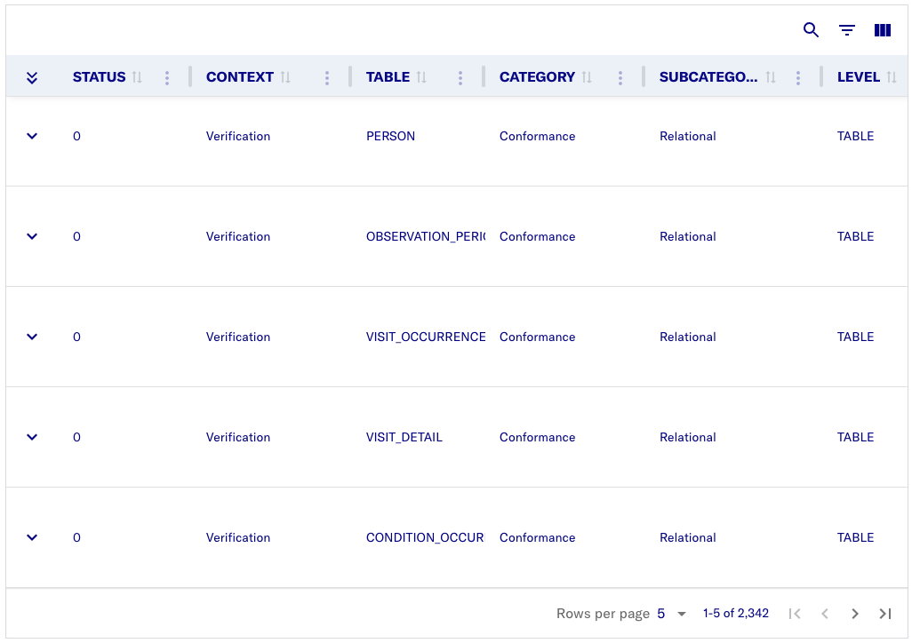
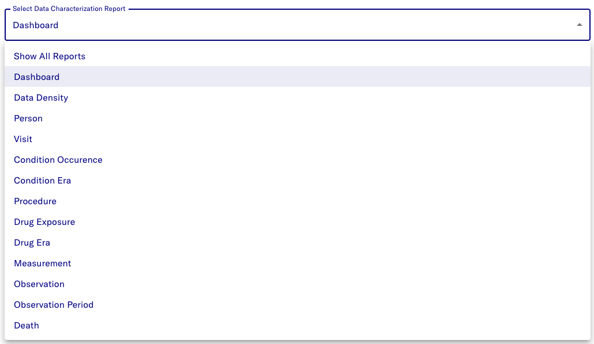

# Dataset

## Dataset information page

The dataset information page contains further details about the dataset:

-   Detailed information

-   Details on how to access the data

-   Metadata

-   Download options for any resource files that the data provider added

If you only have the Viewer role, you can also request access from here
using the Request access button. 

### Data quality dashboard

The data quality dashboard (DQD) executes a set of around 4,000 specific
data quality checks against the database and assesses the results using
a predetermined threshold. The quality checks are organized according to
the [<u>Kahn
framework</u>](https://www.ncbi.nlm.nih.gov/pmc/articles/PMC5051581/).
It employs a system of categories and contexts that stand in for methods
for evaluating the quality of data. For full details on the DQD, you can
read the [<u>official DQD
documentation</u>](https://ohdsi.github.io/DataQualityDashboard/).

The DQD results table organizes the output according to the following
main categories:

-   **Plausibility:** Does the data conform with basic logical and
    medical expectations? 
    
    *Example*: Does the measurement unit provided
    for a specific lab test make sense (for example, is it a unit like
    cm or m for body height)?

-   **Conformance:** Does the data conform to the OMOP Common Data
    Model? 
    
    *Example*: Is the patient ID given for a diagnosis entry indeed the primary ID of an entry in the PATIENT table?

-   **Completeness:** Are all the expected data elements and vocabulary
    mappings present? 
    
    *Example*: Does every medication entry have a
    standard OHDSI code identifying the medication given?

The DQD results table also provides a complete list of all checks run,
including a check description, the fraction of failed rows, and the
overall check pass/fail outcome.

A more detailed result of each test is also provided in the results section. Each test can be examined here including the SQL query used to run the test and the output of that specific test. This allows for easy identification of the rows that were considered failures by the Dashboard.

### Data characterization dashboard

The Data characterization dashboard (DCD) provides a top-level set of
summary statistics to understand the data profile of a database in its
totality. This quantitative assessment of a database typically includes
questions such as:

-   What is the total count of persons in this database?

-   What is the distribution of age for persons?

-   How long are persons in this database observed for?

-   What is the proportion of persons having a treatment, condition,
    procedure, etc. recorded or prescribed over time?

These database-level descriptive statistics also help you to understand
what data may be missing in a database.

By default, the characterization charts show a summary characterization. Use the dropdown menu at the top to change the characterization detail from the options available.

