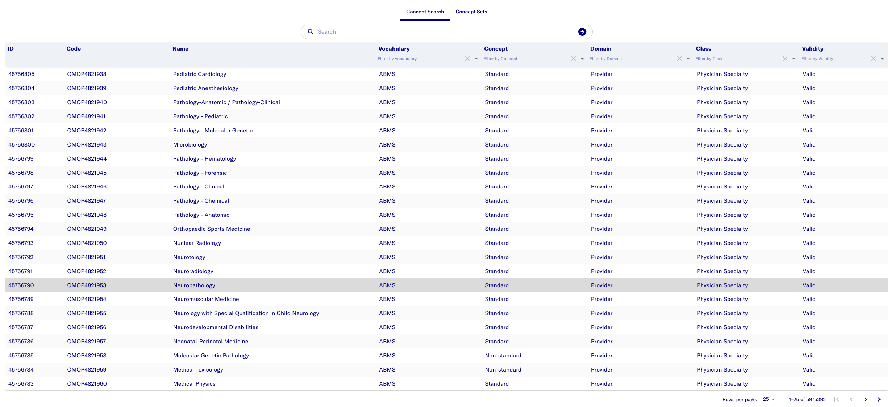
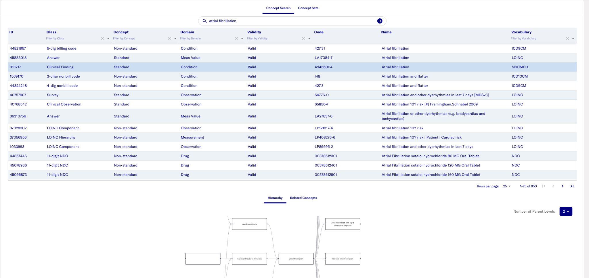
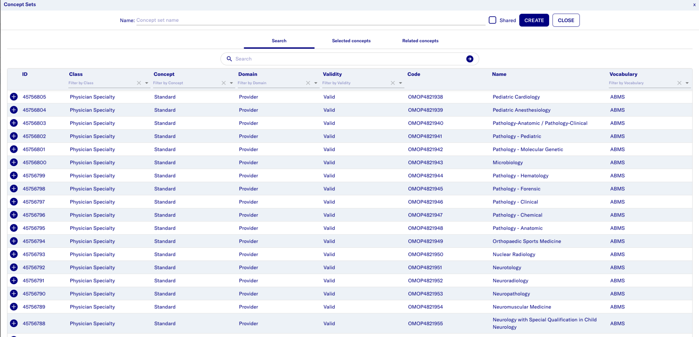

# Concepts

## Introduction

Concepts describe information in a patient’s medical record, such as a
condition, a prescription they are taking, a doctor’s visit and other
information.

* ID - A random ID assigned to be used as a primary key.
* Code - Identifiers from the source vocabularies.
* Name - Each concept has one name in English.
* Vocabulary - Unique case-sensitive alphanumeric ID, generally following the abbreviated name of the vocabulary
* Standard/Non-standard Concept - Standard concept is the one concept representing the meaning of each clinical event. Non-standard concepts are not used to represent clinical events but are present in the vocabularies.
* Domain - Domains are subject areas such as conditions, drugs,
measurements, and so on.
* Class - Concept class name used to create additional structure to the concepts within each vocabulary.
* Validity - Vocabularies keep getting updated and this field indicates whether the concept is valid or deprecated.

In the Concept Search tab, you can look for specific concepts and
explore the hierarchy of concepts along with suggestions for other
related concepts.

## Concept sets

A concept set is a collection of concepts and it is intended to be reusable in various analyses.  

In the Concept Sets tab, you can search for any saved concept sets for a
specific dataset. To edit any saved concept set, click the edit icon.

**Creating a new concept set**

1. Click “Add Concept Set” to start creating a new concept set.

2. To search for any concept across all domains, use the search field.
    Click the plus icon next to the ID to add the concept to your set.
    You can filter by the following:

    * Class,
    * Concept (standard/non-standard),
    * Domain,
    * Validity (valid/invalid)

    You can see the concepts added to the set by looking at the Selected
    concepts tab and can click the minus sign to remove any you might
    not want. You can also look into the related concepts tab to get more
    suggestions on concepts that might be relevant to your concept set
    based on the concepts you have already selected.

3. Enter a concept set name and click Create to save the concept.

4. Optional: To save any changes made after this, click Update.

5. Click Close to close this window.

All saved concept sets can be used in the cohort creator to create
cohorts.
