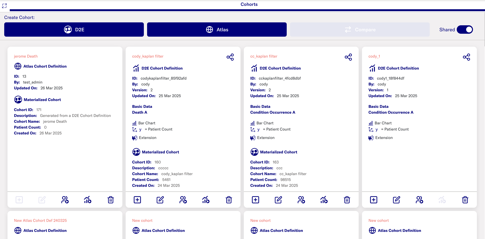
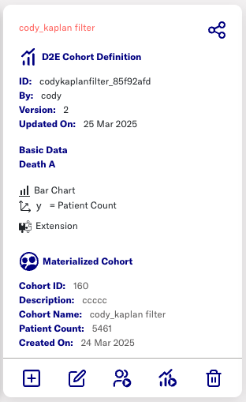
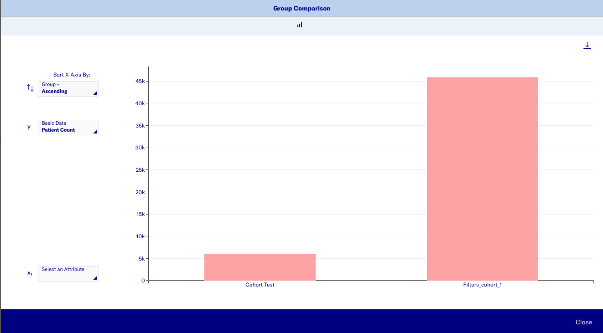
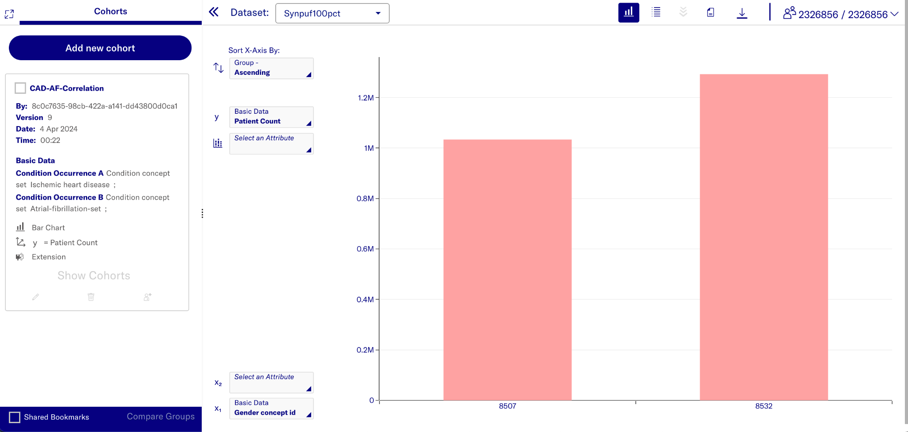
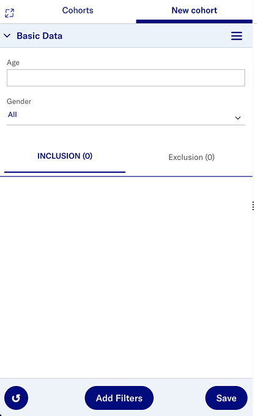
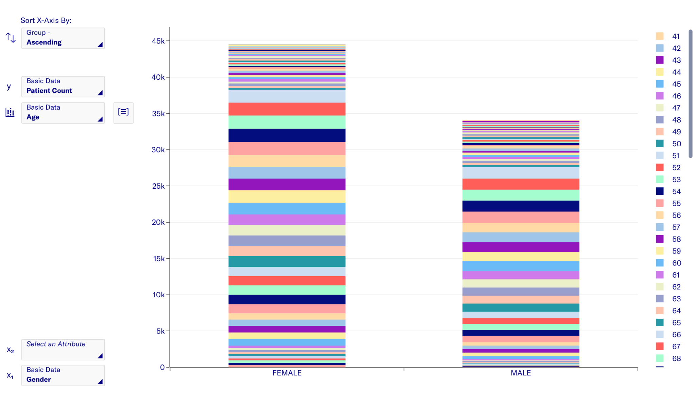

# Cohorts

Cohorts (also called phenotypes) are a set of patients that fulfill some
inclusion and exclusion criteria for a duration of time. A cohort can
also be defined independently of the other cohorts used in a study,
thereby enabling their reuse for other studies. Data2Evidence enables
building of cohorts using a cohort creator that provides instantaneous
feedback on cohort sizes and other parameters.

## Cohort overview

You can see a list of cohorts you have already created and saved in the
cohort overview. To see cohorts that were shared with you, toggle the
Shared Bookmarks on the top right of the page. Click any of the cohort cards to load a cohort definition.

**Cohort definition cards**

The cohort definition cards have a few options displayed depending on the actions performed after saving the filters.

A shared icon is shown on top right of the card if it is a shared definition. If it is only avaiable to you, there will be no icon there. The cohort definition can be renamed using the edit button on the bottom.

**Group comparision**

On the bottom row, the first plus symbol adds this cohort to a group comparision. Two or more cohorts can be compared against each other by adding to a group comparision and clicking the Compare button on top. A bar chart is generated showing a comparision of the cohorts against each other.

**Saving patients to cohort**

Patients who match the filter criteria can be saved to a cohort by using the "Materialize cohort" button. This creates a materialized cohort and details can be seen in the definition card. Multiple cohorts can be materialized across different datasets using the same cohort definition card.

**Cohort quality dashboard**

A cohort quality check can be run on a materialized cohort. This runs the same checks as the data quality dashboard, but on the subset of data included in the materialized cohort.

**Delete cohort definition**

Click the delete icon to delete the cohort definition.

There are two ways to create a new cohort from here - a Data2Evidence cohort using the cohort builder solution or an ATLAS cohort using the ATLAS interface.

## ATLAS cohort

Click the ATLAS button to load a minimal implementation of the ATLAS interface and start creating your cohort. More documentation on how to use ATLAS can be found here - [ATLAS Wiki](https://github.com/OHDSI/Atlas/wiki).

## Data2Evidence cohort

The Cohort builder is a no-code,
browser-based, interactive solution to build cohorts.

### Basic concepts

**Filter area**

The filter area is on the left of the screen. Each filter is displayed
in this area as a filter card. This is also where you specify and refine
the filter criteria for creating your cohorts by adding filter cards.
The default filters loaded depend on the installation.

The filter cards in the Inclusion tab are the inclusion criteria and
patients matching the criteria here are included in the cohort and the
visualizations.

The filter cards in the Exclusion tab are the exclusion criteria and
patients matching the criteria here are excluded from the cohort and the
visualisations.

Click the "Enter Fullscreen" icon on the top left of the filter area to maximise the filter area and hide the chart area.

**Chart area**

The chart area is on the right of the screen. It displays a bar chart of
the information, by default. It changes continuously based on the
applied filters.

Click the "Hide Filtering Area" icon on top left of the chart area to maximise the chart area and hide the filter area.

**Patient count**

The number on the top right of the screen is the
current person count shown as the number of patients fulfilling the
filtering criteria / total number of patients in the database.

Note that this may be a restricted number of patients, depending on your access rights.

**Filter summary**

A list of all filters applied can be seen by clicking on the "View filter summary" icon on the top right next to the download icon. The SQL code used to implement selected filters can be downloaded from here too.  The cohort definition can be exported from here for import into ATLAS. Note that the conversion from Data2Evidence cohort defintion to ATLAS definition is not 1:1 and will result in a slightly different output in ATLAS.

### Creating new cohort

**Adding new filter card**

Add new filter cards by clicking the Add filters button. A menu
is displayed with the kinds of filter cards that can be added. Choose the domain
of the filter card and subsequently choose the criteria for the card. The default
fields are Concept set and Domain type concept set.

To add other criteria to this card, click the Menu icon (3 lines) at the
top right of the card. You can remove, reset, or rename the filter card
from this menu too.

Enter your search terms in the fields of the filter cards and
the system will display a list of suggestions as you type. The number of
values for any attribute displayed in the dropdown list is configured by
the system administrator. If the dropdown displays the message: “Refine
your search”, the number of suggestions exceeds the configured system
limit. Continue entering text to further refine your search and see the
suggestions displayed. If no suggestions are available, the message is
“No suggestions available”.

These cards can be added in Inclusion or Exclusion tab depending on cohort design.

**Boolean relationship between cards**

If you add a new filter card after the first one has been configured,
you will get the “AND” boolean relationship between the subsequent
cards. This means that patients fulfilling both filter criteria will be
included/excluded from the cohort. You can click this “AND” button to
switch to the “OR” relationship which means that patients fitting either
filter card criteria will be included/excluded from the cohort.

**Temporal relationships**

To add a temporal relationship between any filter cards, add the
advanced time option from the Menu of one of the filter cards. Define
the time interaction in terms of days, and in relation to the start and
end dates of the interactions. There can also be an overlapping temporal
relationship.

**Save and reset filters**

To save your filter cards, click the Save button and enter the details.
This filter setting can also be shared with other users. Clicking the
Reset icon resets everything in the cohort creator, including filter
cards and previously added charts.

**Restrictions on number of patients**

If the filtering criteria does not have any relevant patients in the
dataset or the number of patients in the cohort drops below a certain
threshold, a warning message is displayed at the top of the screen.

### Chart actions

Move your cursor over a column to get a quick view of the attributes
that form the group and its numeric value. You can also choose a second
attribute for the x-axis to split the columns or for the y-axis to have
a stacked chart. You can reset any of the selections using the dropdown
menu.

Charts are only displayed for groups with a minimum number of patients.
Results with fewer patients than the specified minimum are not displayed
on the charts. This is to preserve privacy and avoids identifying
individual patients based on the charts.

**Adding filters from chart**

You can also click a column in the chart and click the “Filter by
Selection” button to filter the data and add the attributes of the
column to the filter cards.

**Sorting and Binning**

You can change the sorting of the groups on your x-axis by choosing the
order in the dropdown of the x-axis. The default sorting is either
alphabetical or numerical in ascending order. You can also reduce the
number of groups by combining together groups within a range of
numerical attributes. This is called binning. Use the binning icon next
to the axis selector field and specify the bin size.

**Export chart**

To export chart data as a CSV or PNG file, use the Download option.
These exports do not contain your filter information or underlying data.

### Patient list

It is possible to view the patient list by clicking on the Patient list
button, if it has been enabled. You might not be able to see all the
patients that match your filter criteria in the patient list. The
patient list does not show aggregated data – so you can only see the
patients that you have permission allowed to access. You can edit this
patient list table to include additional criteria and interactions to
show.

**Export data**

The table can be downloaded, if enabled by administrator. Choose "Export to ZIP File" to export a zip of multiple CSV files. A CSV file is exported for each set of interaction type columns currently displayed in your patient list. These CSV files
contain details of the attributes shown for each interaction type as well as the patient ID for each patient.

These CSV files may be used in external applications for further analysis.
