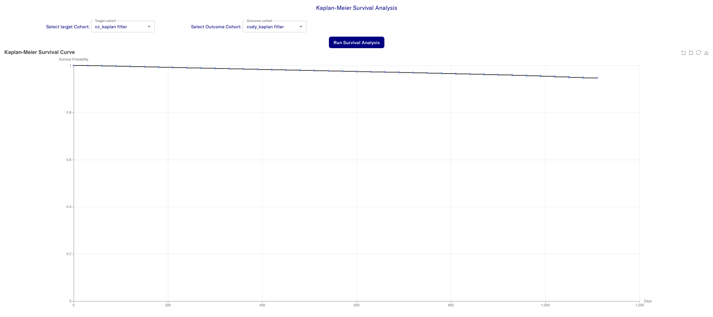

# Analysis

The dropdown here provides a list of different pre-configured analyses
that can be performed on your dataset.

## Kaplan-Meier Survival Analysis

Kaplan-Meier analysis is a statistical method used to estimate the survival probability over time in the presence of censored data-cases where the event of interest (e.g., death, failure, or recovery) hasn’t occurred by the end of the study or is unknown due to loss of follow-up. It’s widely applied in medical research, reliability engineering, and other fields tracking time-to-event outcomes.

A target cohort and an outcome cohort should be selected using the dropdown. The survival graph gets plotted after the analysis is run.

