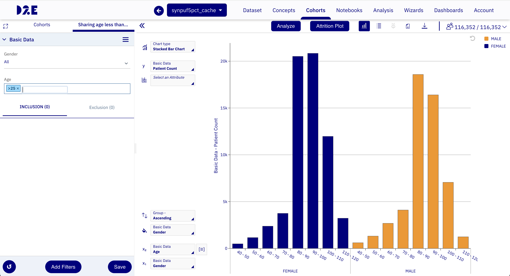
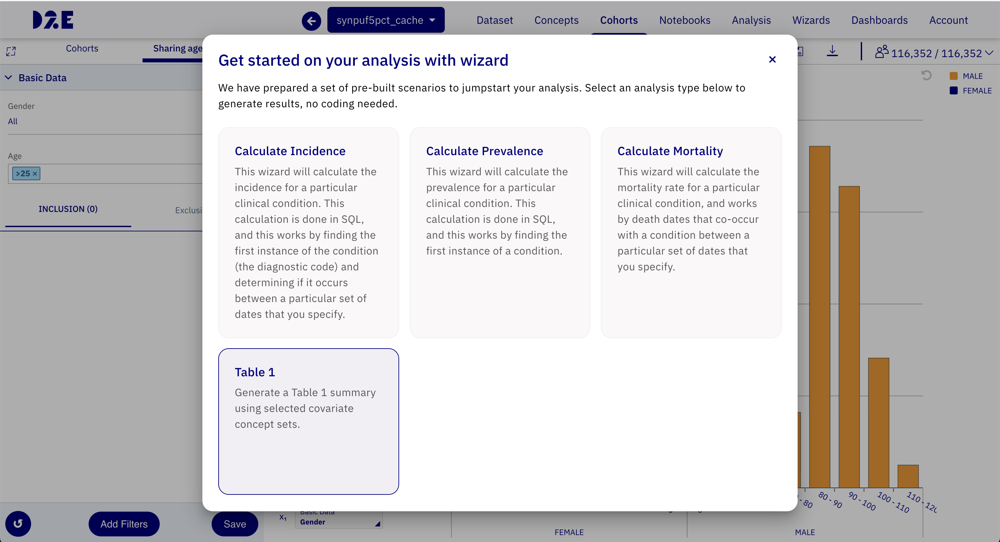
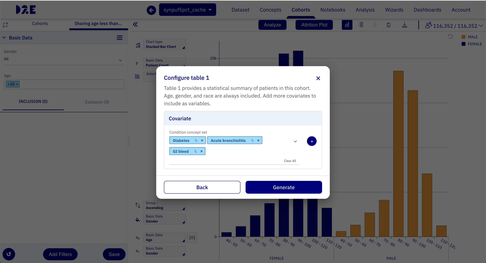
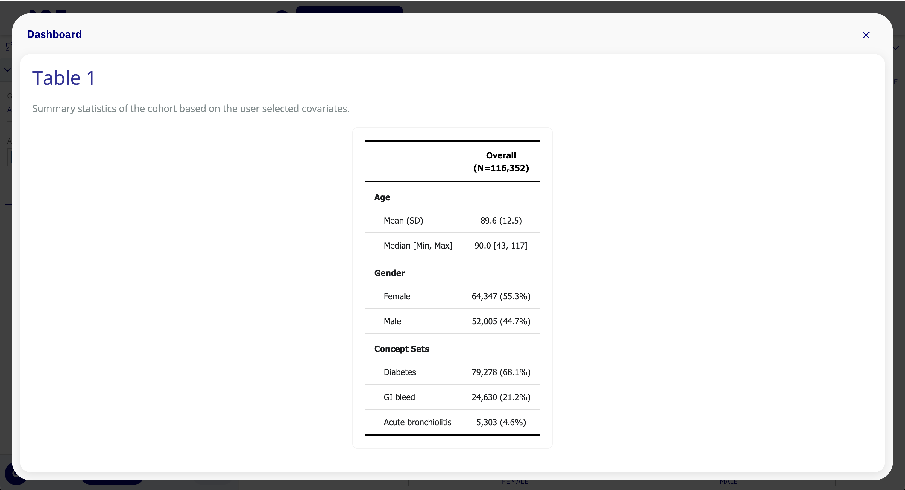

# Table 1

A Table 1 is a baseline characteristics table used in clinical and epidemiological studies to describe the study population. It typically summarizes demographic and clinical covariates such as age, gender, and selected conditions.

Table 1 is commonly used to:

- Provide a quick overview of who is in the cohort.
- Compare subgroup characteristics.
- Support transparency and reproducibility in study reporting.
- Validate that cohort filters and concept selections produced the expected population profile.

## Create a Table 1 in Data2Evidence

Use the following workflow to generate Table 1 from a cohort in Data2Evidence.

### Step 1: Create and materialize a cohort

Create a D2E cohort by adding your inclusion and exclusion filters in the cohort builder and save.

### Step 2: Open analysis dashboards

Click the **Analyze** button for the materialized cohort. This opens the analysis popup with available dashboards, including **Table 1**.

### Step 3: Select concept sets

When Table 1 is launched, you are prompted to select concept sets.

- You can select one or more existing concept sets.
- You can also create a new concept set by adding concept IDs.

### Step 4: Review the generated Table 1

Proceed to the dashboard to render the final output. The Table 1 view displays default covariates such as **Age** and **Gender**, along with user-selected concept set covariates.

## Notes

- You can choose as many concept sets as needed for the same cohort.
- Table 1 results depend on the currently selected dataset and materialized cohort.
- If privacy thresholds are configured, low-count outputs may be suppressed based on system policy.
