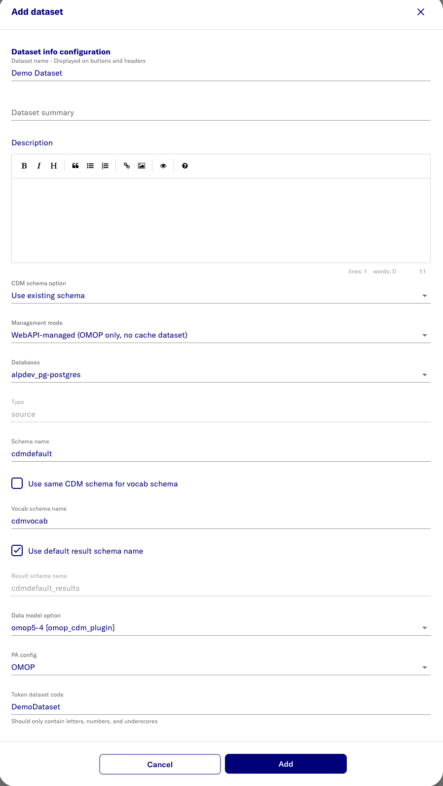
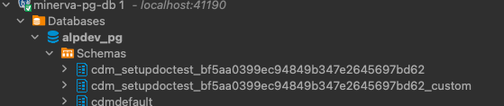

# Create a dataset

- Open [https://localhost:443/portal](https://localhost:443/portal)
- Login as initial admin and swith to Admin Portal
- Go to **Datasets** > **Add dataset**

Name | Value | Note
--- | --- | ---
Dataset name | eg. Demo
CDM Schema Option | select 'Use existing schema' from dropdown
Management mode | WebAPI-managed (OMOP only, no cache dataset)
Schema Name field | e.g. cdmdefault | name of the cdm schema that was used for seeding
Vocab schema name | e.g. cdmvocab
Result Schema Name | e.g. cdmdefaultresults | For creating cohort and cohort definition tables. Must be different from Schema Name
Data Model Option | omop5-4 [datamodel-plugin]
PA Config | OMOP
Token dataset code | e.g. DemoDataset
Cache Dataset Name | e.g. Demo Cache
Cache dataset type | OMOP



- Expected result:


- Expected result:

```bash
PROJECT_NAME=$(grep -E '^PROJECT_NAME=' .env 2>/dev/null | awk -F'=' '{print $2}' | tr -d '"') 
PROJECT_NAME=${PROJECT_NAME:-"d2e"}
CONTAINER_NAME=$PROJECT_NAME-minerva-postgres-1
docker exec -it $CONTAINER_NAME psql -h localhost -U postgres -p 5432 -d alpdev_pg --command "SELECT schema_name FROM information_schema.schemata where schema_name like 'cdm%';"
```


