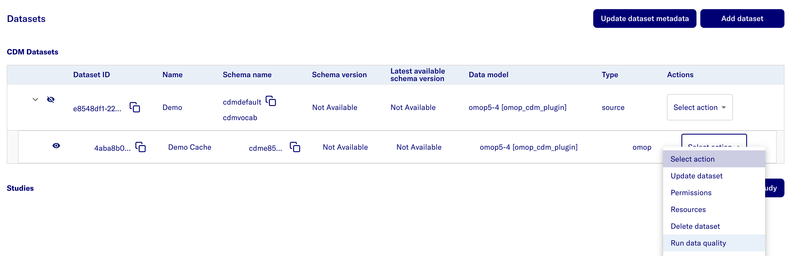
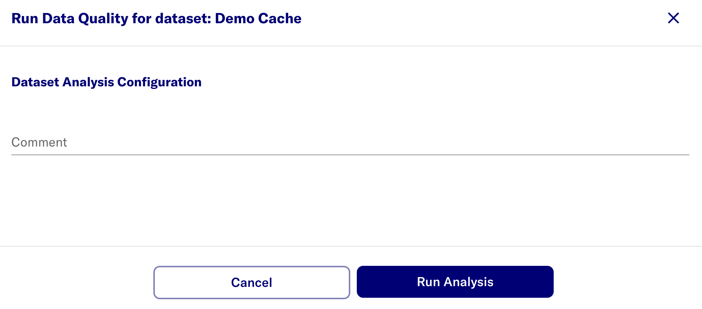

# Data Quality job

- In the Admin Portal, go to **Datasets**. Go to the source dataset of interest.
- Uncollapse the source dataset to views its cache dataset and click **Select Action**.
- Select **Run data quality**

- Select the **Run Analysis** button.

- After completing the Data Quality job run, the dashboards is available through the researcher portal.

