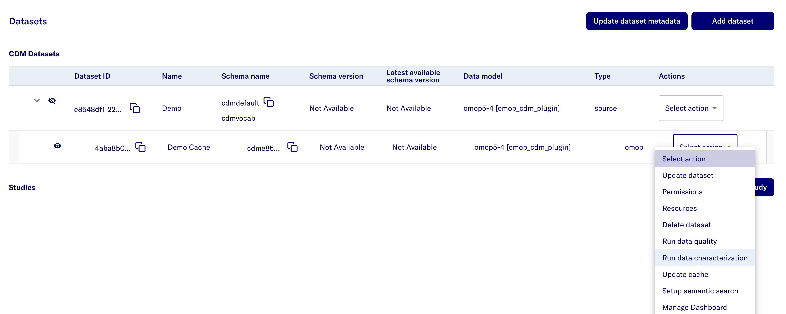
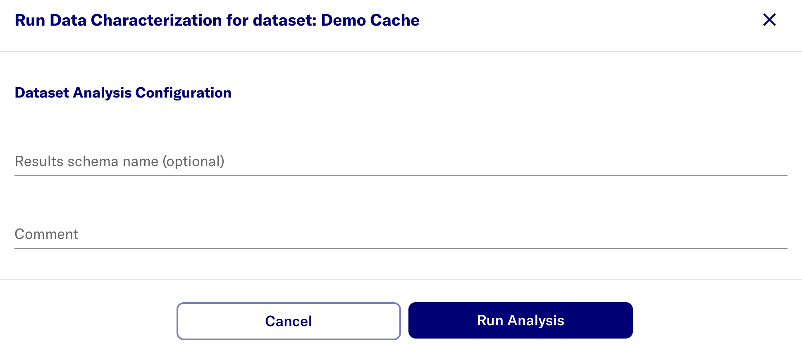
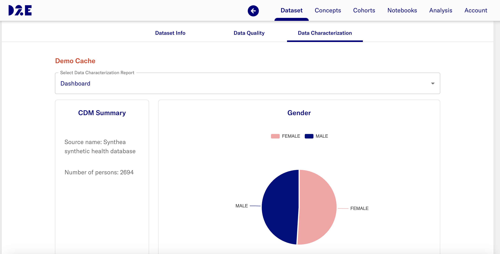
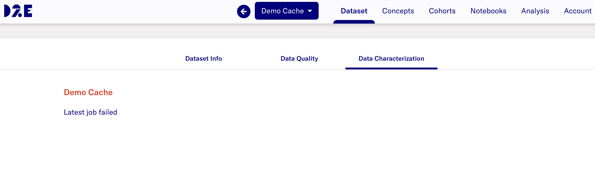
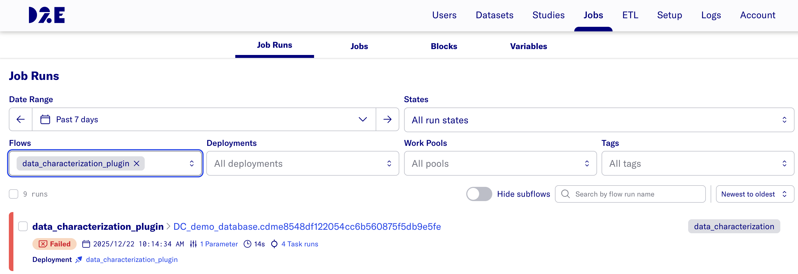
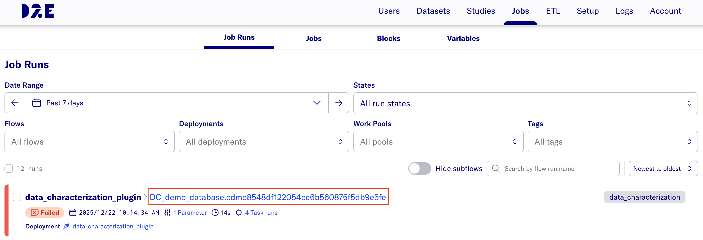
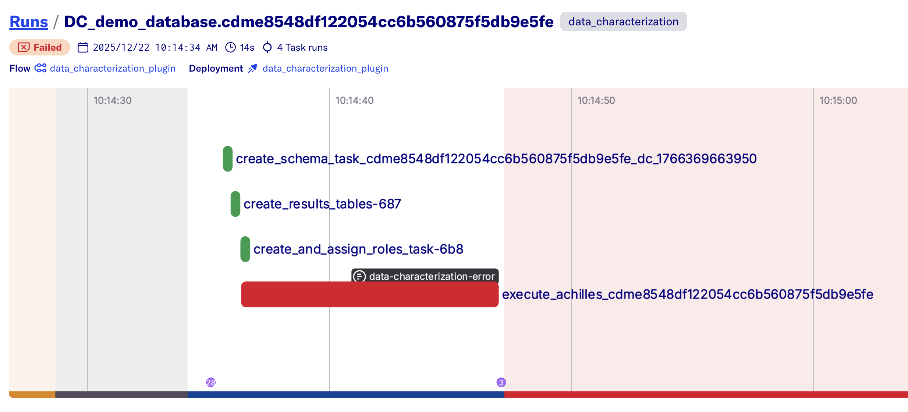
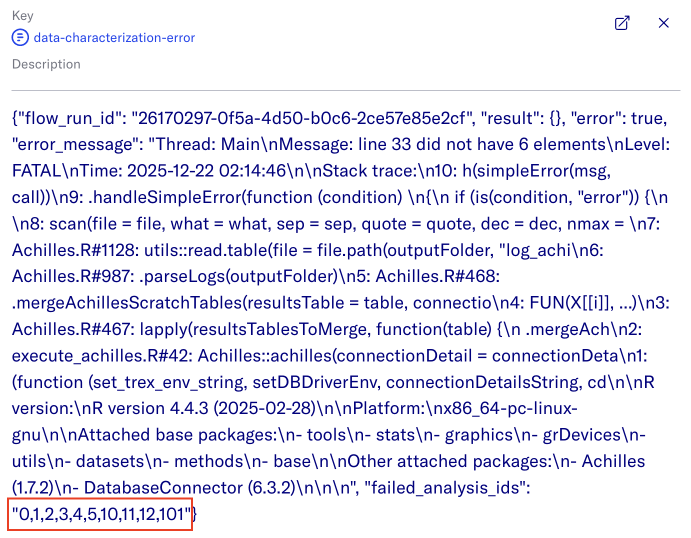
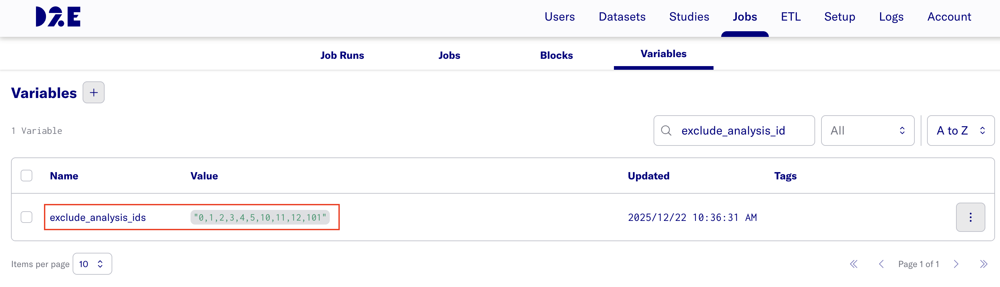

# Data Characterization job

- In the Admin Portal, go to **Datasets**. Go to the source dataset of interest.
- Uncollapse the source dataset to views its cache dataset and click **Select Action**.
- Select **Run data characterization**

- (Optional) Pass in a results schema name that contains the cohort and cohort_definition tables
- Select the **Run Analysis** button.

- After completing the Data Characterization job run, the dashboard is available through the researcher portal.

# Error Handling
- The Data Characterization job fails when the following occurs:
    - The dashboard for the dataset in the researcher portal displays an error **Latest job failed**
    
    - In Admin Portal **Jobs** page, the latest job run shows the status **Failed**
    

- To check the logs, click the hyperlink after **data_characterization_plugin >**

- Click the grey box that says **data-characterization-error**

- This will open a window with the json logs of the job run. 

- If there are failed analysis ids, copy the string and update the **exclude_analysis_ids** variable in **Jobs** > **Variables** 

    > **Note:** The value must be formatted as a comma-separated list of integers within a string (e.g., `"1,2,3"`).

    > **Note:** The **exclude_analysis_ids** variable currently applies to all data characterization flow runs.
