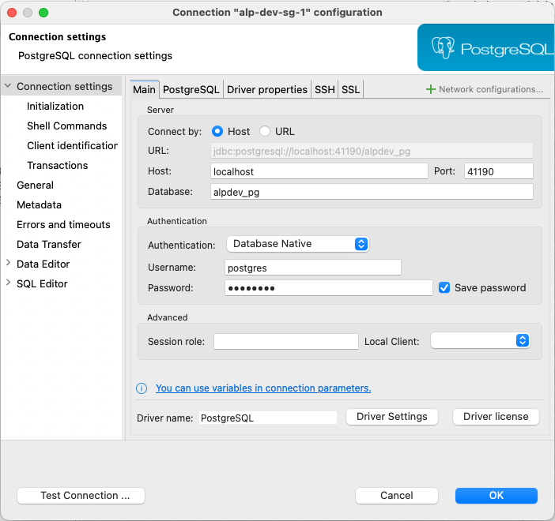

# DBeaver

Universal database tool and SQL client. See[https://dbeaver.io/](https://dbeaver.io/).

## macOS

- [https://formulae.brew.sh/cask/dbeaver-community](https://formulae.brew.sh/cask/dbeaver-community)

```bash
brew install --cask dbeaver-community
```

## Connection settings

- Password is `${PG_SUPER_PASSWORD}` in `.env.local`


