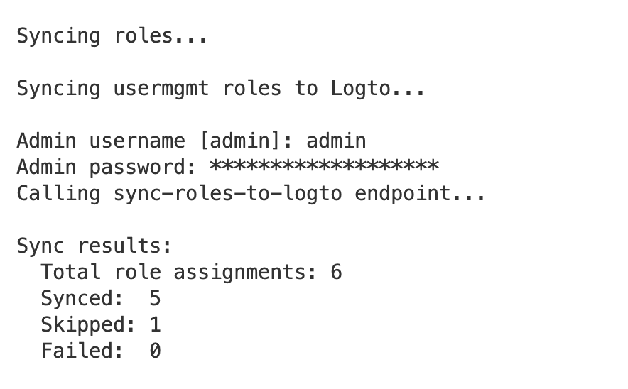

# Upgrading D2E

## v0.15 to v0.16

> **Note:** These upgrade instructions are version-specific and cover incremental upgrades between consecutive versions only. Skipping versions has not been tested and is not recommended.

### Sync Roles

On first startup after upgrading, `syncroles` runs automatically and prompts for admin credentials. This step is required only on the first startup after upgrading.



Upon successful completion, the following output is displayed:
```
All roles synced successfully. Set USER_MGMT__ROLE_SOURCE=logto in .env.local
```
