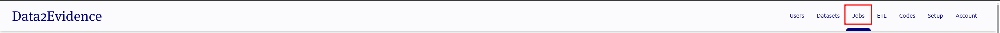
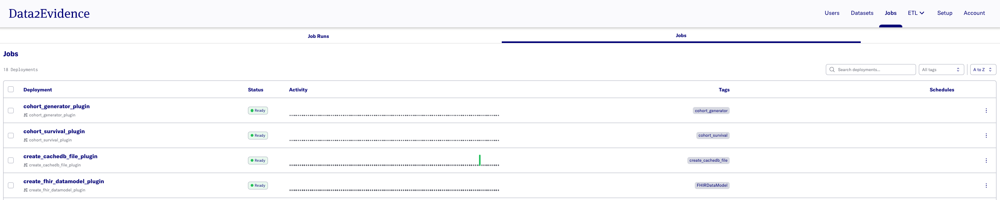
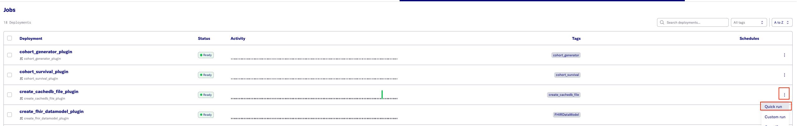
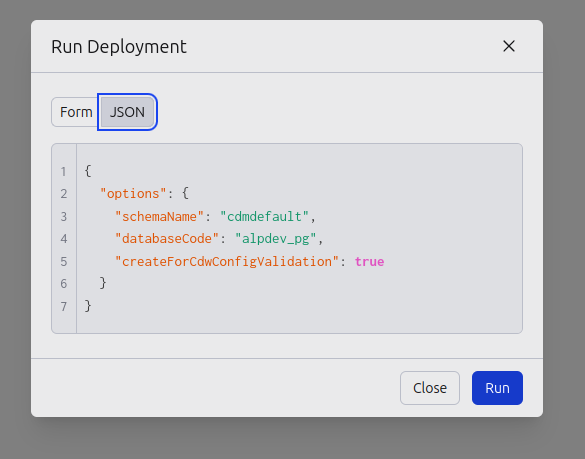

# Create cdw config DuckDB database file used for validation (Optional)

The alp-minerva-cdw-svc uses a DuckDB database file for validation purposes. This file comes with the source code at `services/cdw-svc/src/duckdb/cdw_config_svc_validation_schema`.

However, in the case of further updates to any data models, an updated validation DuckDB database file is required. In order to create this updated validation DuckDB database file, run the following steps.

Prerequisite: `create_cachedb_file_plugin` job is available in the Job Portal

- [D2E-Plugins/flows/base/duckdb](https://github.com/data2evidence/d2e-flows/tree/develop/flows/base/create_cachedb_file_plugin)

## Creating via portal

- open [https://localhost:443/portal](https://localhost:443/portal)
- Login as primary admin and change to Admin Portal
- Go to **Jobs**
  
- Click the **Jobs** tab.
  
- Click the `⋮` icon, and select **Quick Run**.
  

- Click the **JSON** tab and enter values to create a cdw-config validation DuckDB database file for cdmdefault

  name | value | note
  --- | --- | ---
  Flow parameters | `{ "options": { "schemaName": "cdmdefault", "databaseCode": "alpdev_pg", "createForCdwConfigValidation": true } }` | Create cdw-config validation DuckDB database file for cdmdefault schema

  Example:

  
