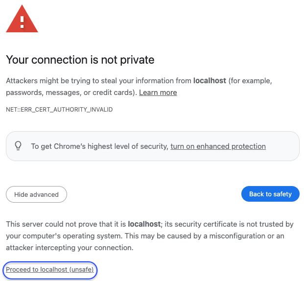

# Log in as initial admin

## Data2Evidence

- Input the Researcher Portal URL into a Chrome Web Browser:

  - [https://localhost:443/portal](https://localhost:443/portal) - local workstation
  - `https://<FQDN>/portal` - remote server

- A message indicating `Your connection is not private` is expected due to the self-signed certificate
- Click Advanced>Proceed to localhost (unsafe)

> 

## Log in

- Log in as Admin with following credentials:
  - username - `admin`
  - password - `Updatepassword12345`

## Change your password

- Once you login, it is recommended change your password
- On top right click `Account`
- On left -> Select `Change password`
- Enter Old Password & New password / Click `Generate`
- Click `Update`
