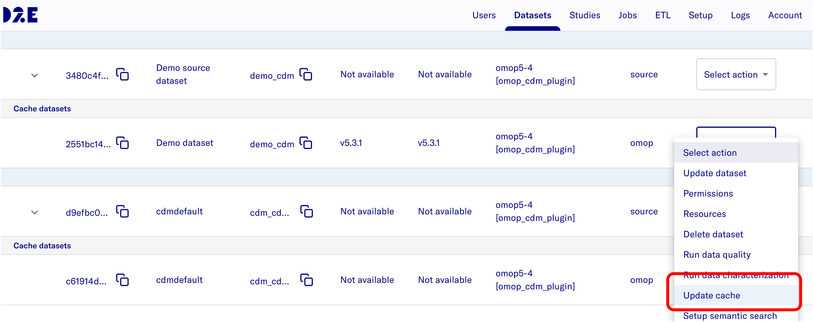
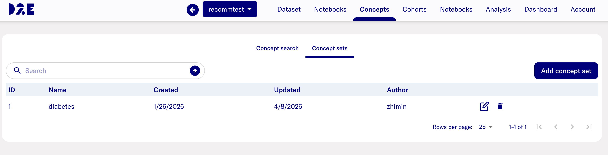
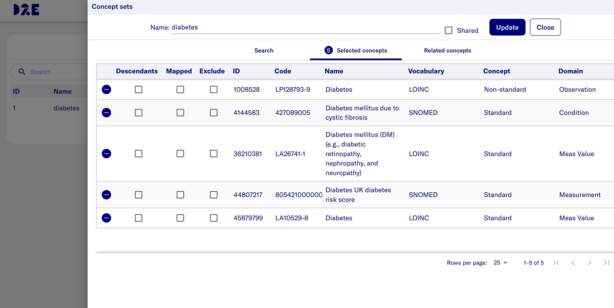
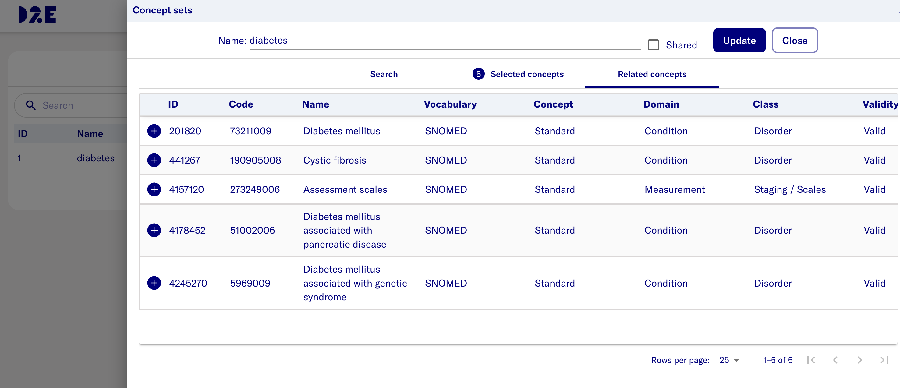

# Load concept_recommended table

## Prerequisites

- Athena vocabularies have already been loaded into the `cdmvocab` schema. See [Load Athena vocabularies](7-load-vocab.md).

## Step 1: Download the data

- The `concept_recommended` table data is maintained by OHDSI as part of the PHOEBE project.
- Download the latest `concept_recommended_20240527.zip` from the [OHDSI PHOEBE SharePoint](https://ohdsiorg-my.sharepoint.com/personal/cknoll_ohdsi_org/_layouts/15/onedrive.aspx?id=%2Fpersonal%2Fcknoll%5Fohdsi%5Forg%2FDocuments%2FPHOEBE&ga=1)
- Unzip the file and move it to the `cache/vocab` directory in your D2E project:

```bash
cd $GIT_BASE_DIR
GIT_BASE_DIR=$(pwd)
VOCAB_DIR=$GIT_BASE_DIR/cache/vocab
unzip -o path/to/download/concept_recommended_202240527.zip -d $VOCAB_DIR/
```

## Step 2: Transform the data

- Apply the same escaping and quoting transformation used for other vocabulary files, and copy the result to the `transformed` folder alongside the other Athena vocab files:

```bash
cd $VOCAB_DIR
sed 's/\"/\"\"/g;s/,/\"\t\"/g;s/\(.*\)/\"\1\"/' concept_recommended_20240527.csv >> ./transformed/CONCEPT_RECOMMENDED.csv
```

## Step 3: Create the concept_recommended table

- Check whether the `concept_recommended` table already exists in the CDM schema:

```bash
PROJECT_NAME=$(grep -E '^PROJECT_NAME=' .env 2>/dev/null | awk -F'=' '{print $2}' | tr -d '"')
PROJECT_NAME=${PROJECT_NAME:-"d2e"}
CONTAINER_NAME=$PROJECT_NAME-minerva-postgres-1
docker exec -it $CONTAINER_NAME psql -h localhost -U postgres -p 5432 -d alpdev_pg --command "
SELECT table_name FROM information_schema.tables
WHERE table_schema = 'cdmvocab' AND table_name = 'concept_recommended';"
```

- If the table does not exist, create it:

```bash
docker exec -it $CONTAINER_NAME psql -h localhost -U postgres -p 5432 -d alpdev_pg --command "
CREATE TABLE IF NOT EXISTS cdmvocab.concept_recommended (
    concept_id_1        INTEGER NOT NULL,
    concept_id_2        INTEGER NOT NULL,
    relationship_id     VARCHAR(20) NOT NULL
);"
```

## Step 4: Load data into the concept_recommended table

- Use the `data_load_plugin` to insert content into the `concept_recommended` table:

```bash
CONTAINER_NAME=$PROJECT_NAME-dataflow-gen-worker
docker exec -it $CONTAINER_NAME prefect deployment run data_load_plugin/data_load_plugin --param options='{"files":[{"name": "CONCEPT_RECOMMENDED","path": "/app/vocab/CONCEPT_RECOMMENDED.csv","truncate": true,"table_name": "concept_recommended"}],"header": true,"encoding": "utf_8","chunksize": 50000,"delimiter": "\t","schema_name": "cdmvocab","database_code": "alpdev_pg","escape_character": null,"empty_string_to_null": null}'
```

- Check the container logs to confirm data was loaded:

```bash
docker logs --tail 100 $CONTAINER_NAME
```

- Once the flow is completed, the container logs the message `Finished in state Completed()`
- Expected output is:
  > COPY `${LINE_COUNT}`

## Step 5: Update cache

- After loading data, go to D2E **Datasets** page of **Admin** portal and update the cache so that concept recommendations are reflected in the application.


## Step 6: Test the functionality

- Navigate to the D2E **Concept** page in "Research" portal and select one "Concept sets"

- Add interested concept sets 

- Verify that concept recommendations appear as expected in Related concepts tab.

