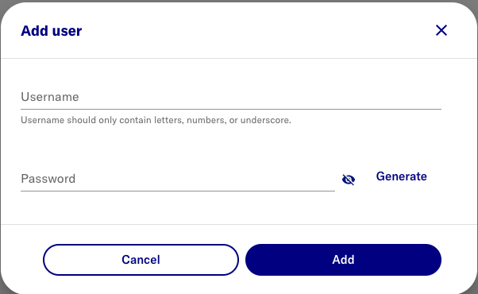
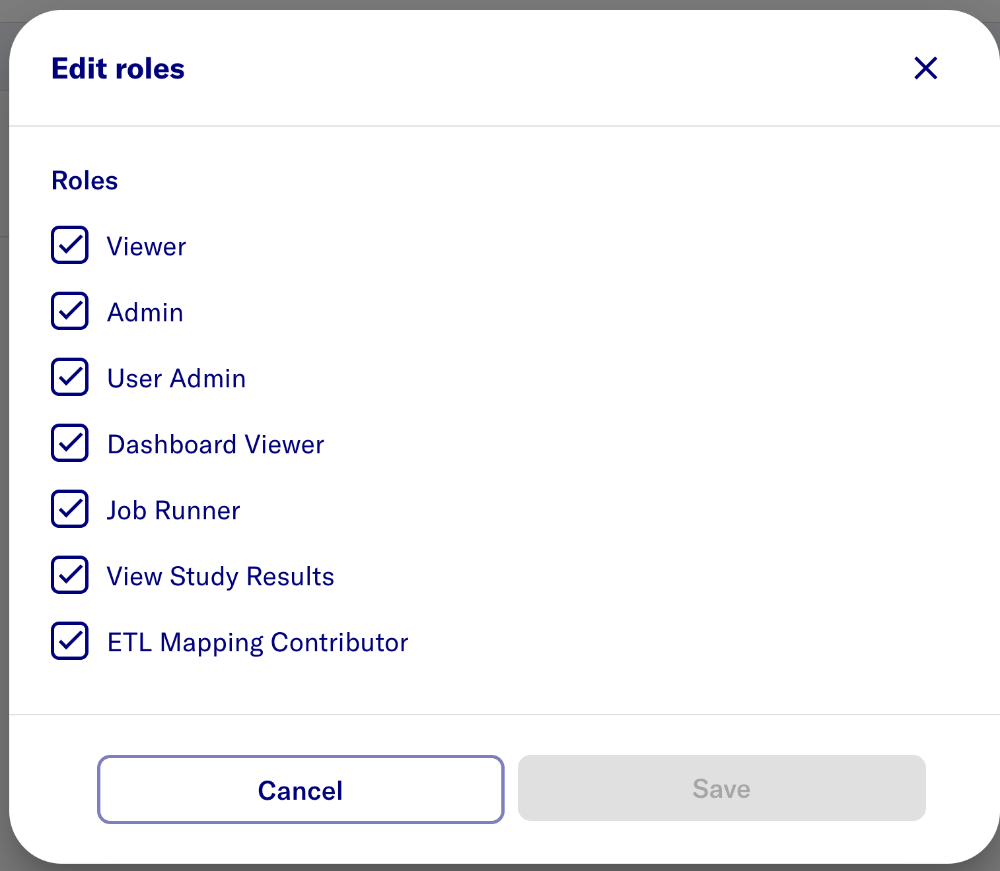
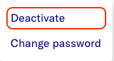

# Users and Roles

## Users

### Add Primary Admin user

- Log in to Data2Evidence using a Chrome web browser

  - [https://localhost:443/portal](https://localhost:443/portal) - local workstation
  - `https://<FQDN>/portal` - remote server

- Switch to **Admin Portal**
  - On top right, Click **Account**
  - On middle left, Click **Switch to Admin Portal**
- On top right, Select **Users**
- Click **Add user**

### Edit roles

- On the new user row, click **Edit** and **Select** the following roles.

:::note

Default role **Viewer** is sufficient for **Researcher** access

:::

### Deactivate inital admin

:::warning

Ensure another user has been granted all admin roles.

:::

- click the 3-dots icon for admin user
- select **Deactivate**

