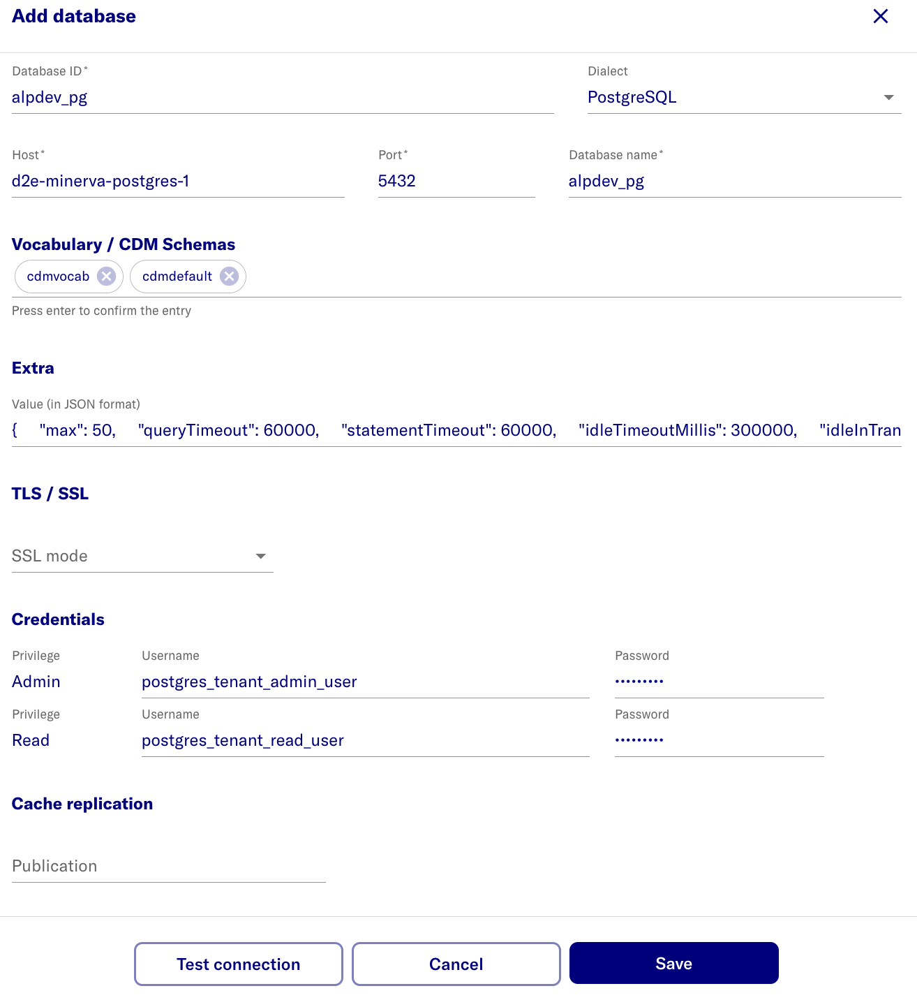

# Configure patient database credentials

## Add database connection details and credentials

- Log in to the Researcher Portal using a Chrome web browser

  - [https://localhost:443/portal](https://localhost:443/portal) - local workstation
  - `https://<FQDN>/portal` - remote server

- Login as the new admin user
- Switch to **Admin Portal**
- Select **Setup** on top right
- URL is now:
  
  - [https://localhost:443/portal/systemadmin/setup](https://localhost:443/portal/systemadmin/setup) - local workstation
  - `https://<FQDN>/portal/systemadmin/setup` - remote server

- Select **Databases** **Configure** button
- Select **Add database**
- Enter the database information.
  - Values below are based on setting up the sample synpuf1k database. Adjust and configure it as per your requirements.
  - (for users following the steps to create synpuf1k database) Add the values from the table below based on the previous [Postgres database and users setup](./3-setup-pg-permissions.md) step.
- Click **Save**

| name                      | value                             | note                                                        |
| --------------            | --------------------------        | -----------------------------------------------------                                             |
| Database ID               |    alpdev_pg                      | display name                                                                                      |
| Host                      | d2e-minerva-postgres-1            | PostgreSQL container name /or/ external database FQDN. Ensure the correct container name is used. |
| Database name             | alpdev_pg                         | actual name                                                                                       |
| Vocabulary / CDM Schemas  | `cdmvocab`  `cdmdefault`          | Enter the vocab/cdm schemas value and press **Enter** to confirm.                                 |
| Extra                     | `{"max": 50, "schema": "cdmdefault", "queryTimeout": 60000, "statementTimeout": 60000, "idleTimeoutMillis": 300000, "connectionTimeoutMillis": 60000, "idleInTransactionSessionTimeout": 300000}` |  |
|TLS / SSL | Select `None` | `^`
| Admin username            | postgres_tenant_admin_user        | `*`                                                                                               |
| Read username             | postgres_tenant_read_user         | `*`                                                                                               |
| Admin password            | \***\*\*\*\***                    | `@`                                                                                               |
| Read password             | \***\*\*\*\***                    | `@`                                                                                               |
| Cache replication         |                                   |  Not required                                                                                     |

:::note
- `^` - Specify SSL mode. 
  For SSL connection, select `Allow` and enter the CA cert in base64 format. 

  - Example of converting pem file to CA cert: 
    ```bash
    curl -s https://truststore.pki.rds.amazonaws.com/global/global-bundle.pem | base64
    ```
- `*` - schema/usernames are the values expected for sample data load steps - do not change
- `@` - create a random password
  - For synpuf1k dataset setup use the password that was created for `postgres_tenant_admin_user` and `postgres_tenant_read_user` respectively in section [3-setup-pg-permissions](./3-setup-pg-permissions.md).
- For the `extras` JSON, the `schema` value is used in certain endpoints where a dataset has not been created yet `(e.g checkIfSchemaExists)`. Therefore, when setting up this extras JSON, it should be ensured that the `schema` value defined here does exist in the database.
:::



## After adding database

**The expected result after adding a database is:** 