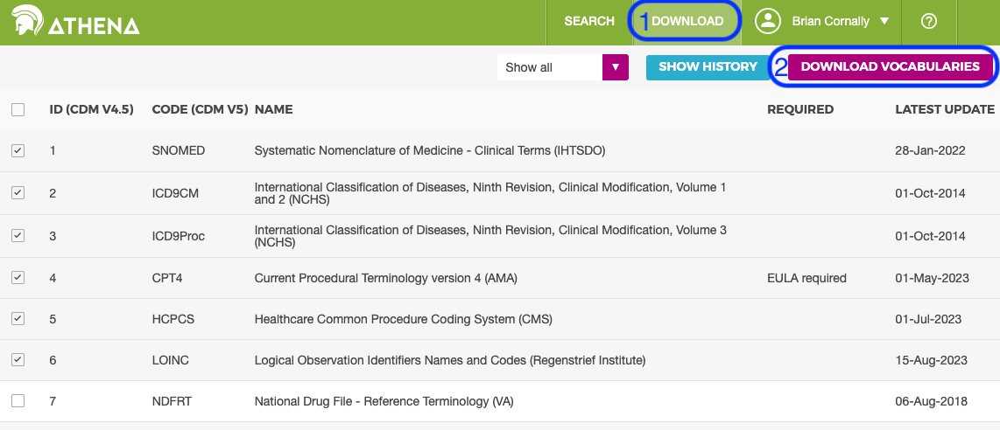

# Load Athena vocabularies

## Download vocabularies

- Open [https://athena.ohdsi.org/search-terms/start](https://athena.ohdsi.org/search-terms/start)
- Register (free), if needed
- Login

> 

- Select **DOWNLOAD** button at top right of page
- Default vocabularies are automatically selected
- Confirm CDM version 5.x at top right
- Enter a name
- Click **DOWNLOAD**
- Await email with download link (typically within ~1 hour)
- Download ~174Mb zipfile to `Downloads` folder
- Run the following commands in the d2e directory:

```bash
cd $GIT_BASE_DIR
GIT_BASE_DIR=$(pwd)
VOCAB_DIR=$GIT_BASE_DIR/cache/vocab
mkdir -p $VOCAB_DIR
ZIP_FILE="$(ls -tr ~/Downloads/vocabulary_download_v5*.zip | head -1)"
cd $VOCAB_DIR
unzip -o -d . "${ZIP_FILE}"
```

- remove additional file

```bash
rm CONCEPT_CPT4.csv
```

## Confirm line count before transformation

- Run command to output line count for each CSV file

```bash
wc -l *.csv | sort -nr
```

- Output should be:

```bash
  130981848 total
  72754470 CONCEPT_ANCESTOR.csv
  47212425 CONCEPT_RELATIONSHIP.csv
   5975393 CONCEPT.csv
   2980116 DRUG_STRENGTH.csv
   2058224 CONCEPT_SYNONYM.csv
       691 RELATIONSHIP.csv
       418 CONCEPT_CLASS.csv
        60 VOCABULARY.csv
        51 DOMAIN.csv
```

- Note that unzipped CSV file from Athena contains an extra new line that is empty.

## Transform csv files to expected format

- Escape existing double quotes
- Add double quotes around each value
- This transformation is done in case there is a literal string character e.g. `\t` or `\n` in the value.
- Enclosing the values in double quotes would prevent interpretation as a tab or newline.
- Move files to a folder named `transformed`

```bash
mkdir transformed
for CSV_FILE in *.csv; do sed "s/\"/\"\"/g;s/\t/\"\t\"/g;s/\(.*\)/\"\1\"/" $CSV_FILE >> ./transformed/$CSV_FILE; done
```

## Confirm Line Count of Transformed CSVs before ingestion

- Run command to output line count for each CSV file

```bash
wc -l *.csv | sort
```

- Linecounts are similar to:

```bash
        51 DOMAIN.csv
        60 VOCABULARY.csv
       424 CONCEPT_CLASS.csv
       697 RELATIONSHIP.csv
   1669979 CONCEPT_SYNONYM.csv
   2981808 DRUG_STRENGTH.csv
   6071643 CONCEPT.csv
  38570317 CONCEPT_RELATIONSHIP.csv
  72374968 CONCEPT_ANCESTOR.csv
 121669947 total
```

- Note that unzipped CSV file from Athena contains an extra new line that is empty.

## Load data to cdmvocab

- Run the following command in terminal to stop an Data2Evidence Docker container and start another container to load data

```bash
cd $GIT_BASE_DIR
PROJECT_NAME=$(grep -E '^PROJECT_NAME=' .env 2>/dev/null | awk -F'=' '{print $2}' | tr -d '"') 
PROJECT_NAME=${PROJECT_NAME:-"d2e"}
CONTAINER_NAME=$PROJECT_NAME-dataflow-gen-worker
docker exec -it $CONTAINER_NAME prefect deployment run data_load_plugin/data_load_plugin --param options='{"files":[{"name": "CONCEPT_ANCESTOR","path": "/app/vocab/CONCEPT_ANCESTOR.csv", "truncate": "True", "table_name": "concept_ancestor"},{"name": "CONCEPT_CLASS","path": "/app/vocab/CONCEPT_CLASS.csv", "truncate": "True", "table_name": "concept_class"},{"name": "CONCEPT_RELATIONSHIP","path": "/app/vocab/CONCEPT_RELATIONSHIP.csv", "truncate": "True", "table_name": "concept_relationship"},{"name": "CONCEPT_SYNONYM","path": "/app/vocab/CONCEPT_SYNONYM.csv", "truncate": "True", "table_name": "concept_synonym"},{"name": "CONCEPT","path": "/app/vocab/CONCEPT.csv", "truncate": "True", "table_name": "concept"},{"name": "DOMAIN","path": "/app/vocab/DOMAIN.csv", "truncate": "True", "table_name": "domain"},{"name": "DRUG_STRENGTH","path": "/app/vocab/DRUG_STRENGTH.csv", "truncate": "True", "table_name": "drug_strength"},{"name": "RELATIONSHIP","path": "/app/vocab/RELATIONSHIP.csv", "truncate": "True", "table_name": "relationship"},{"name": "VOCABULARY","path": "/app/vocab/VOCABULARY.csv", "truncate": "True", "table_name": "vocabulary"}],"schema_name":"cdmvocab","header":"true","delimiter":"\t","database_code": "alpdev_pg", "chunksize": "50000", "encoding": "utf_8"}'
```

- Docker container logs can be checked with the bash command `docker logs --tail 100 $CONTAINER_NAME`
- Once the flow is completed, the container logs the message "Finished in state Completed()"
- expected output is
  > COPY `${LINE_COUNT}`

## Validation

- Confirm data loaded with by select count(\*) from tables

```bash
CONTAINER_NAME=$PROJECT_NAME-minerva-postgres-1
docker exec -it $CONTAINER_NAME psql -h localhost -U postgres -p 5432 -d alpdev_pg --command "SELECT table_name, row_count FROM (SELECT 'concept_relationship' AS table_name, COUNT(*) AS row_count FROM cdmvocab.concept_relationship UNION SELECT 'concept_ancestor' AS table_name, count(*) AS row_count FROM cdmvocab.concept_ancestor UNION SELECT 'concept_relationship' AS table_name, COUNT(*) AS row_count FROM cdmvocab.concept UNION SELECT 'relationship' AS table_name, COUNT(*) AS row_count FROM cdmvocab.relationship UNION SELECT 'concept_synonym' AS table_name, COUNT(*) AS row_count FROM cdmvocab.concept_synonym UNION SELECT 'vocabulary' AS table_name, COUNT(*) AS row_count FROM cdmvocab.vocabulary UNION SELECT 'domain' AS table_name, COUNT(*) AS row_count FROM cdmvocab.domain UNION SELECT 'drug_strength' AS table_name, COUNT(*) AS row_count FROM cdmvocab.drug_strength UNION SELECT 'concept_class' AS table_name, COUNT(*) AS row_count FROM cdmvocab.concept_class) temp ORDER BY row_count DESC;"
```

- Expect output row_count similar to:

table_name      | row_count
----------------------|-----------
 concept_ancestor     |  72754469
 concept_relationship |  47212424
 concept              |   5975392
 drug_strength        |   2980115
 concept_synonym      |   2058223
 relationship         |       690
 concept_class        |       417
 vocabulary           |        59
 domain               |        50

## Next steps

- Continue with configuring [a dataset](../../1-datasets/1-create-dataset.md)
- Configure the concept recommendation functionality [here](./11-load-recommended-table.md)

## Troubleshooting

### Repeat load

- To repeat, run "Load data to cdmvocab" commands in the sequence given
