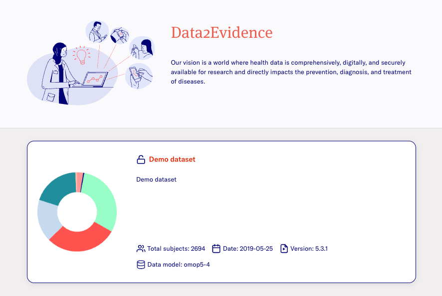
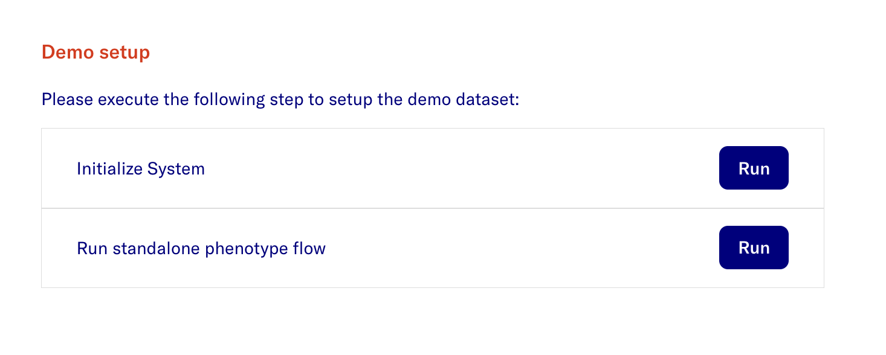

# Broadsea-atlasdb

- This section guides users on setting up a demo dataset. Initially, the Data2Evidence system does not contain any data.
- It uses broadsea-atlasdb docker container, which is part of the OHDSI Broadsea set of Docker containers.
- Below are alternative methods to setup broadsea-atlas database:

## Setting up demo dataset via command line
>
> Note: You need to start Data2Evidence with `d2e -e start` in order to use the demo dataset

Run the command:

```bash
./d2e setupdemo
```

- Upon completion, switch to the Researcher Portal by going to *Account > Switch to Researcher Portal*

> **The expected display is:**
>
> 

## Setting up demo dataset via UI

- Open the Researcher Portal and click **Switch to the Admin Portal**.

- In the Admin Portal click **Setup**
- Click the **Demo Setup** - **Configure** button.

> **The expected display is:**
>
> 

- **Setup demo database and dataset** - Click the **Run** Button
- Go to **Datasets > Demo Dataset > Permissions** and add access to the dataset to your user e.g. admin.
- **Log out** and **Log in** again to the **account** page
- Go to **Jobs** and wait until all jobs are completed
- Switch to the Researcher Portal by going to *Account > Switch to Researcher Portal*

> **The expected display is:**
> 
