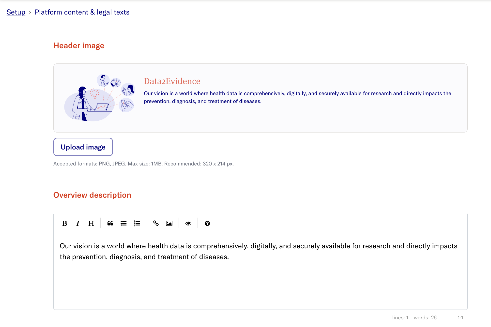
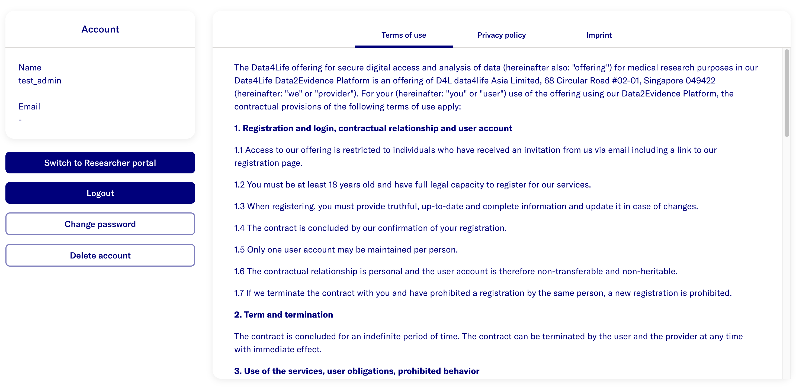

# Legal Documentation

## Setting up legal documentation via UI

- Open the Researcher Portal and click **Switch to the Admin Portal**.
- In the Admin Portal click **Setup**
- Click the **Platform content & legal texts** - **Configure** button.

> **The expected display is:**
>
> 

This page lets you configure the platform's header image, overview text and legal documents. The following sections are available:

- **Header image** - Upload a custom banner image (PNG or JPEG, max 1MB, recommended 320 x 214 px) shown on the overview page. Use **Upload image** to set one, or **Restore default** to revert to the built-in illustration. A live preview is shown above the buttons.
- **Overview description** - The introductory text displayed on the overview/landing page.
- **Data quality description** - Text describing the data quality of the platform.
- **Terms of use** - Your terms of use document.
- **Privacy policy** - Your privacy policy document.
- **Imprint** - Your imprint / legal notice.
- **Disclaimer** - A disclaimer shown to logged-in users.

Steps:

- Enter the text for each section in the respective editor using markdown format.
- For the **Data quality description**, **Terms of use**, **Privacy policy**, **Imprint** and **Disclaimer** sections, check the respective **Display** checkbox for that page to be displayed in the Account page.
- Once you make a change, a footer appears at the bottom of the page. Click **Save** to apply your changes, or **Discard changes** to revert them.
- Go to the **Account** page

> **The expected display is:**
>
> 
