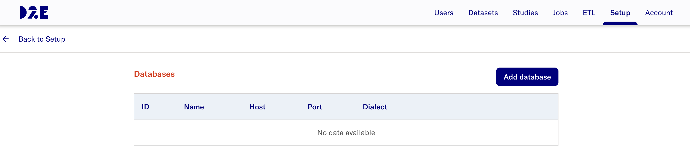
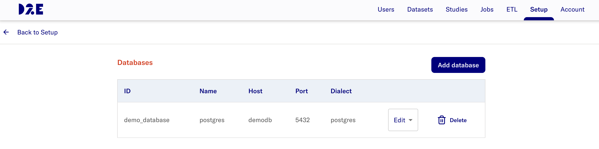
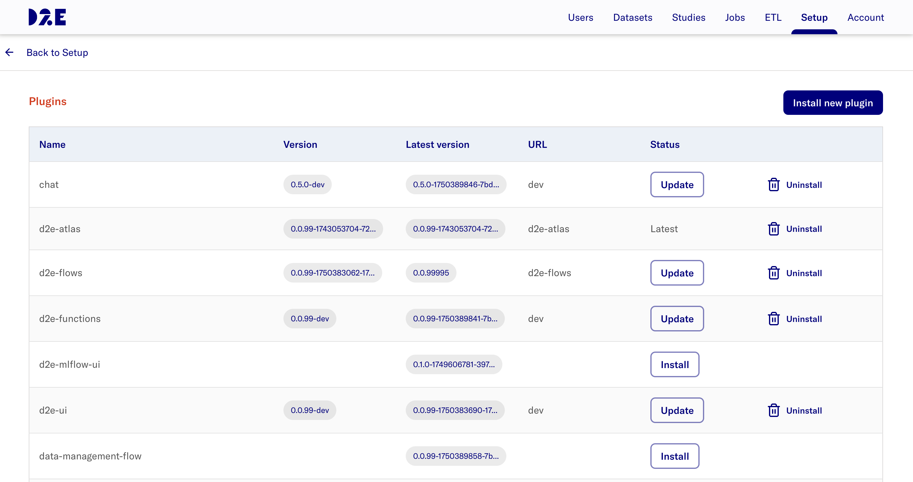
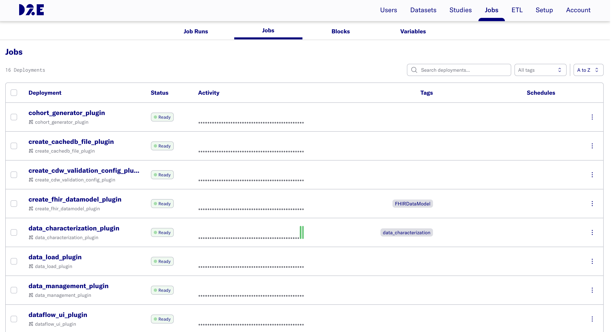
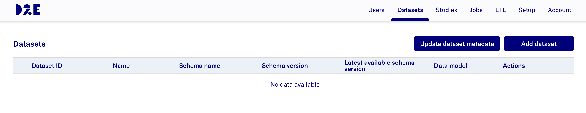
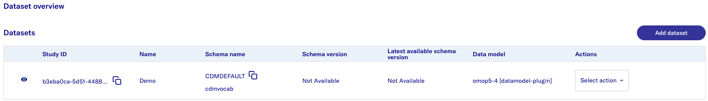
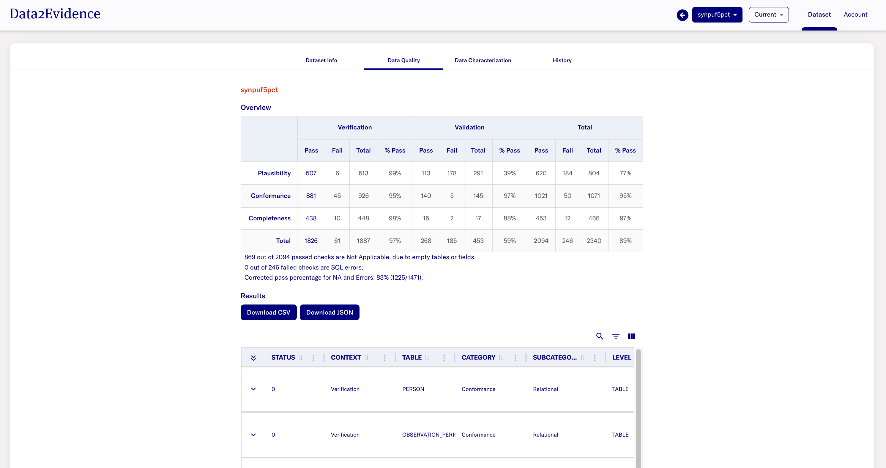

# Data load

## Adding existing databases

This sections assumes that there is an existing database available. The database should be in a Postgres Docker container or external database with a Fully Qualified Domain Name (FQDN).

- In the Admin Portal, go to **Setup** > **Databases** > **Configure** > **Add database**
  
  The expected display is:
  

- Select **Add database** and provide the database information accordingly. Refer to [this part of the documentation](../data-load/4-setup-db-credentials.md) for more details on the input parameters for database creation.
  
  The expected result after adding a database is:
  

If there is no existing databases available, the following sample database can be used. After loading the database, continue with the guide from section [Plugins](#plugins) onwards.

- [broadsea-atlasdb](../data-load/8-load-broadsea.md)

## Plugins

The Admin Portal allows the admin user to manage plugins in the platform, for instance installation, version updates, and uninstallation of plugins.

- In the Admin Portal, go to **Setup** > **Plugins** > **Configure**.
 

## Jobs Portal

The Admin Portal allows the admin user to perform customized and scheduled job runs from [plugins](#plugins) that have been installed.

- In the Admin Portal, go to **Jobs** and select the **Jobs** tab.
  

- Select the `⋮` icon to perform the respective job functions.
- Select **Job Runs** tab to get the job run status.

## Creating Datasets

- In the Admin Portal, go to **Datasets** > **Add dataset**

  > **The expected display is:**

- Provide the dataset [parameters](../../1-datasets/1-create-dataset.md) accordingly.
  > **The expected result upon successful addition of dataset**: 

## Dataset Permissions

The Admin Portal allows the admin to perform dataset management to provide users with permissions for selected datasets.

- In the Admin Portal, go to **Datasets**.
- Go to the dataset you wish to provide/revoke permission access for users.
- Under **Actions** dropdown, select **Permissions** to view users who have requested for access or provide access to existing users.
- Refer to the [documentation here](../)
(../configuration/2-dataset-permissions.md) for a detailed guide on setting permissions.

## Platform Configuration

### Generating Data Quality Dashboard (DQD)

This section outlines the steps required for generating the Data Quality Dashboard for a dataset.

- In the Admin Portal, go to **Datasets**. Go to the dataset of interest and click **Select Action**.
- Select **Run data quality** and select the **Run Analysis** button.
- Repeat the step for **Run data characterization**.
- After completing the **Data Quality** and **Data Characterization** job runs, refer to the Researcher Portal to access the Data Quality Dashboard for the respective datasets.

  > **The expected result is:** 

### Update Datasets Metadata

- In the Admin Portal, go to **Datasets** tab and select **Update dataset metadata**.
- Refer to the [documentation here](../../1-datasets/4-fetch-datasets-metadata.md) for more details.
