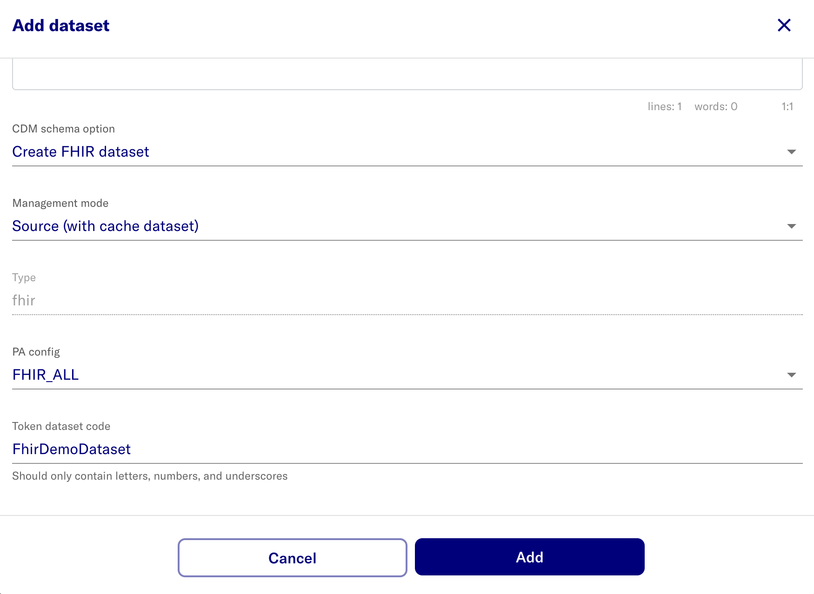

# Create a dataset
- Open the Admin Portal
- Go to **Datasets** > **Add dataset**

Name | Value | Note
--- | --- | ---
Dataset name | eg. Fhir Demo
CDM Schema Option | select 'Create FHIR dataset' from dropdown
PA Config | FHIR_ALL
Token dataset code | e.g. FhirDemoDataset

