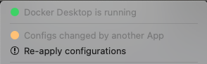
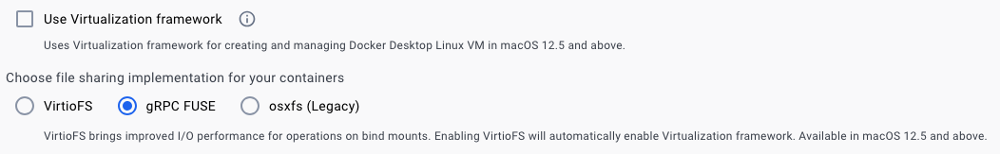

# Docker Compose

## HowTo: Docker Compose yaml parse

### Anchors and aliases

- [https://docs.docker.com/compose/compose-file/10-fragments/](https://docs.docker.com/compose/compose-file/10-fragments/)
- [https://mikefarah.gitbook.io/yq/operators/anchor-and-alias-operators](https://mikefarah.gitbook.io/yq/operators/anchor-and-alias-operators)
- yaml anchors and aliases create re-usable blocks for docker-compose
- to validate merged, expanded, envsubst version:

```bash
bash -c "set -o allexport; source .env.local; yq eval-all --from-file internal/scripts/expand.yq docker-compose.yml docker-compose-local.yml" | yq -P 'sort_keys(..)' | tee private.yq.yml
```

- Docker compose provides shows internal representation. caveat: some sections maybe missing

```bash
docker compose --env-file .env.local --file docker-compose.yml --file docker-compose-local.yml config | yq -P 'sort_keys(..)' | tee private.dc.yml
```

### grep

- set DC_FILE

```bash
DC_FILE=docker-compose.yml
DC_FILE=docker-compose-local.yml
```

- by serviceName

```bash
echo DC_FILE=$DC_FILE; cat $DC_FILE | yq -r '.services.* | (path | .[-1]) + " " + (.networks | @yaml | @json)' 
echo DC_FILE=$DC_FILE; cat $DC_FILE | yq -r '.services.* | (path | .[-1]) + " " + (.volumes | @yaml | @json)' 
echo DC_FILE=$DC_FILE; yq '.services | with_entries(select(.key|test("alp-dataflow-gen-agent|alp-dataflow-gen"))) | .* | (path | .[-1]) + " " + (.networks | @yaml | @json)' $DC_FILE
for DC_FILE in docker-compose.yml docker-compose-local.yml; do echo DC_FILE=$DC_FILE; yq '.services | with_entries(select(.key|test("alp-dataflow-gen-agent|alp-dataflow-gen"))) | .* | (path | .[-1]) + " " + (.networks | @yaml | @json)' $DC_FILE; done
```

- by prop

```bash
cat $DC_FILE | yq -o props '.services.*' | grep -E "container_name|volumes"
```

### Ports in use

```bash
export BASE_PORT=1
grep -oP "http.*${BASE_PORT:-1}.*" docker-compose.yml | envsubst | sort -u | awk -F: '{print $3}' | awk -F/ '{print $1}' | sed -e 's/"//' -e 's/,//' | sort -u
```

## Issue: DNS lookup fails with Docker Compose multiple networks

### Symptoms

- impacts versions of Docker desktop before v2.26.1
- dataflowgen-agent is on a separate network named `data` for security
- sample error message
  > alp-dataflow-gen-agent-1 | Failed to get databases: Error: getaddrinfo ENOTFOUND alp-minerva-gateway-1
- see: [https://forums.docker.com/t/docker-compose-refuses-to-attach-multiple-networks/136776/9](https://forums.docker.com/t/docker-compose-refuses-to-attach-multiple-networks/136776/9)

### Workaround

#### 1 - Add dataflow-gen-agent-1 to alp network

- edit docker-compose-local.yml
- add the following to dataflow-gen-agent-1

```yaml
network:
  - alp
```

#### 2 - Replace docker-compose binary

- from: [https://github.com/docker/compose/issues/11533#issuecomment-2026242708](https://github.com/docker/compose/issues/11533#issuecomment-2026242708)
- latest release version from [https://github.com/docker/compose/releases](https://github.com/docker/compose/releases)
- while Docker desktop is running

```bash
NEW_VERSION=v2.24.7
[[ "$(sysctl machdep.cpu.brand_string)" =~ Intel ]] && ARCH=x86_64 || ARCH=aarch64
URL=https://github.com/docker/compose/releases/download/$NEW_VERSION/docker-compose-darwin-$ARCH
DC_PATH=~/.docker/cli-plugins/docker-compose
DC_TMP=/tmp/docker-compose

OLD_VERSION=$($DC_PATH --version | awk '{print $NF}'); echo OLD_VERSION=$OLD_VERSION
mv -vf $DC_PATH $DC_PATH.$OLD_VERSION
curl -L -o $DC_TMP $URL
chmod u+x $DC_TMP
$DC_TMP --version
cp -vf $DC_TMP $DC_PATH
cp -vf $DC_PATH $DC_PATH.$NEW_VERSION
docker compose version
```

- **Caveat**: change will revert if
  - restart Docker desktop
  - click "Re-apply configurations"



### Resolution

- expected in next release of Docker desktop at which time workaround#1 can be removed
- from: [https://github.com/docker/compose/issues/11533#issuecomment-2034656001](https://github.com/docker/compose/issues/11533#issuecomment-2034656001)
- Compose v2.26.1 in Docker Desktop 4.30.0
- See the release notes for more details.
- [https://docs.docker.com/desktop/release-notes/](https://docs.docker.com/desktop/release-notes/)

## Issue: Node.js segmentation fault on MacOS x86_64 with Virtualization Framework enabled

### Symptoms

- [https://github.com/docker/for-mac/issues/6824](https://github.com/docker/for-mac/issues/6824)
- affects Docker Desktop v4.19+
- sample container logs

```bash
docker logs --tail 1000 -f ${CONTAINER_NAME}
yarn run v1.22.22
$ ts-node updateEnvFiles.ts -s alp-minerva-db-mgmt-svc
Get client credentials token
Segmentation fault
error Command failed with exit code 139.
info Visit https://yarnpkg.com/en/docs/cli/run for
```

### Workaround

- Open Settings>General
- Uncheck **Use Virtualization framework** and select **gRPC FUSE**

> 

## Issue: Node.js segmentation fault on MacOS x86_64 with Virtualization Framework enabled

### Symptoms

- [https://github.com/docker/for-mac/issues/6824](https://github.com/docker/for-mac/issues/6824)
- affects Docker Desktop v4.19+
- sample container logs

```bash
docker logs --tail 1000 -f ${CONTAINER_NAME}
yarn run v1.22.22
$ ts-node updateEnvFiles.ts -s alp-minerva-db-mgmt-svc
Get client credentials token
Segmentation fault
error Command failed with exit code 139.
info Visit https://yarnpkg.com/en/docs/cli/run for
```

### Workaround

- Open Settings>General
- Uncheck **Use Virtualization framework** and select **gRPC FUSE**

> 

### Resolution

- Docker Desktop 4.30.0
- See the [release notes](https://docs.docker.com/desktop/release-notes/) for more details
