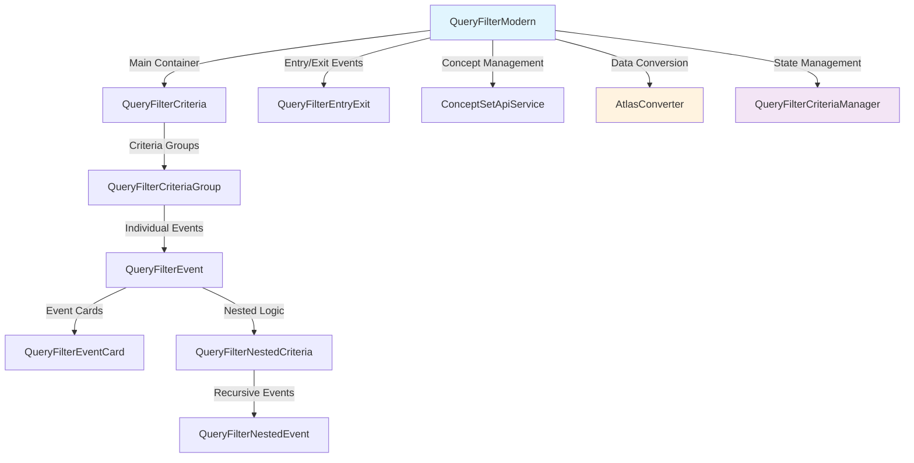
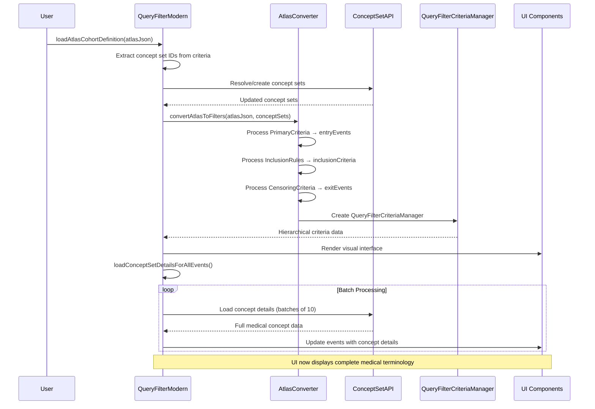
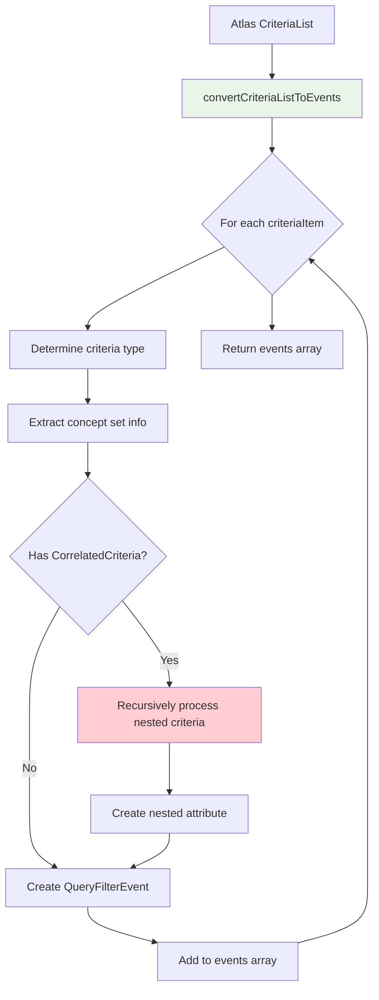
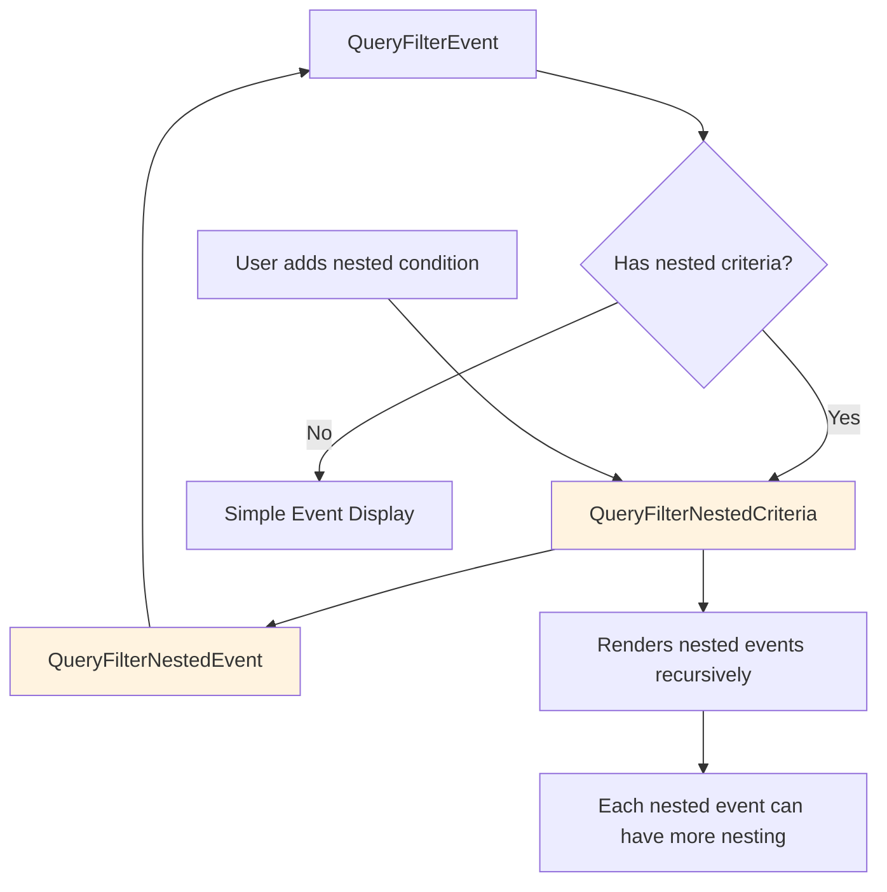
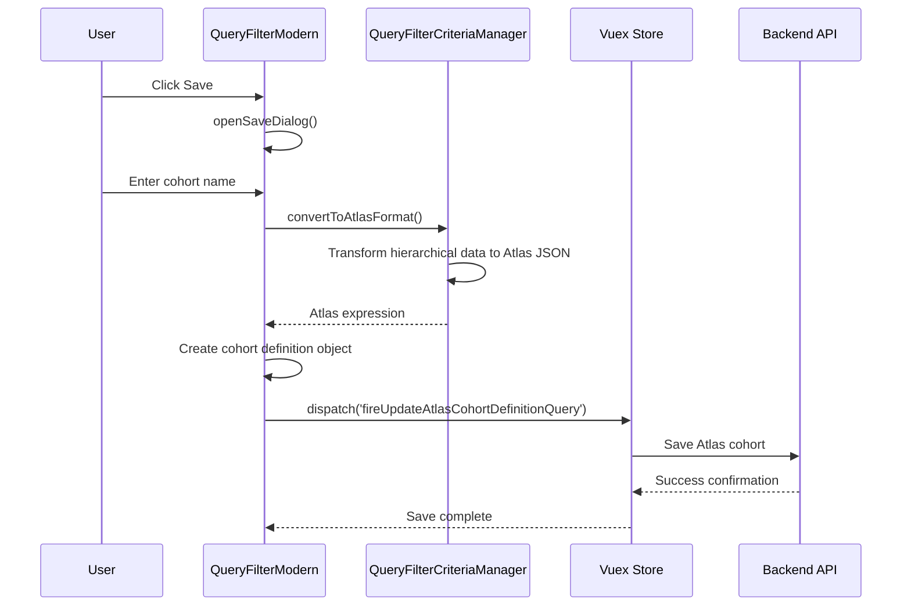
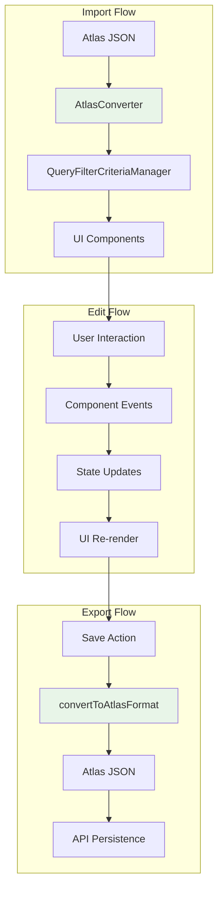

# Query Filter Workflow Documentation

## Overview

The Query Filter module provides a visual interface for building OHDSI Atlas-compatible cohort definitions. It enables users to import Atlas JSON, make visual edits using a hierarchical interface, and save changes back to Atlas format. The system handles complex medical criteria with nested conditions and concept set resolution.

## Component Architecture

The Query Filter system follows a hierarchical component structure that mirrors the complexity of medical cohort definitions:



### Component Responsibilities

- **QueryFilterModern**: Main orchestrator, handles Atlas import/export, concept set loading
- **QueryFilterCriteria**: Manages inclusion criteria groups and their interactions
- **QueryFilterCriteriaGroup**: Handles individual criteria groups with AND/OR logic
- **QueryFilterEventContainer**: Manages collections of events within criteria groups
- **QueryFilterEventCard**: Modern event component with full functionality and visual design
- **QueryFilterEvent**: Legacy event component maintained for backward compatibility
- **QueryFilterNestedCriteria**: Handles recursive nested criteria within events
- **QueryFilterNestedEvent**: Event component designed for nested contexts with level indicators
- **QueryFilterCard**: Main container component for filter groups with multiple conditions and AND/OR operators
- **QueryFilterChip**: Individual filter chips representing selected concepts (removable with multiple variants)
- **AttributesDropdown**: Dropdown for adding criteria-specific attributes with multi-select interface
- **CriteriaSelectorDropdown**: Dropdown for selecting criteria types with medical domain icons and searchable options
- **AtlasConverter**: Core conversion engine between Atlas JSON and UI models
- **QueryFilterCriteriaManager**: State management for hierarchical criteria data

## Import Atlas JSON Process

The Atlas import process involves several steps to convert OHDSI Atlas cohort definitions into the visual interface:



### Key Conversion Functions

#### `convertAtlasToFilters()` - AtlasConverter.ts:18-337

The main conversion function that transforms Atlas JSON into UI models:

1. **Concept Set Resolution**: Maps Atlas concept set IDs to local concept sets
2. **Criteria Processing**: Converts different criteria types (conditions, drugs, procedures)
3. **Nested Handling**: Processes `CorrelatedCriteria` recursively
4. **Attribute Mapping**: Converts Atlas operators to internal format

#### `convertCriteriaListToEvents()` - AtlasConverter.ts:114-223

Recursive function that processes Atlas criteria lists:



## Load from Bookmarks Integration

The Query Filter integrates with the application's bookmark system through the Vuex store:

1. **Bookmark Selection**: User selects an Atlas cohort bookmark
2. **Expression Extraction**: Atlas JSON expression is extracted from bookmark
3. **Import Process**: Standard Atlas import workflow is triggered
4. **UI Population**: Visual interface is populated with bookmark data

The main integration point is in `QueryFilterModern.vue:393-544` where `loadAtlasCohortDefinition()` processes bookmark data.

## Making Changes - Visual Editing

The visual interface allows users to modify cohort definitions through several interaction patterns:

### Event Management

- **Add Events**: Users can add new medical events to criteria groups
- **Configure Events**: Select concept sets, set cardinality, add attributes
- **Nested Criteria**: Create complex nested conditions within events

### Concept Set Handling

- **Selection**: Choose from existing concept sets or create new ones
- **Details Loading**: Concept details are loaded asynchronously for visualization
- **Terminology Integration**: Interface with external terminology services

### Recursive Component Structure

The UI handles nested medical criteria through recursive component rendering:



## Save Process

The save workflow converts the visual interface back to Atlas format and persists the changes:



### Key Save Functions

#### `saveAtlasCohort()` - QueryFilterModern.vue:977-1032

Orchestrates the save process:

1. **Validation**: Ensures cohort name is provided
2. **Conversion**: Calls `convertToAtlasFormat()` to get Atlas JSON
3. **Metadata**: Adds creation/modification timestamps and user info
4. **Persistence**: Dispatches Vuex action to save via API

#### `convertToAtlasFormat()` - QueryFilterModel.ts:571

Transforms UI model back to Atlas JSON structure (method of QueryFilterCriteriaManager class):

1. **Concept Set Management**: Builds unified concept sets array and creates ID mappings
2. **Primary Criteria Conversion**: Converts entryEvents to Atlas PrimaryCriteria format
3. **Inclusion Rules Processing**: Transforms query filter groups into Atlas InclusionRules
4. **Exit Strategy Mapping**: Converts exit events to Atlas CensoringCriteria
5. **Data Type Mapping**: Maps internal event types to Atlas criteria types
6. **Nested Structure Processing**: Recursively processes nested criteria from attributes

## Recursive Data Handling

The system handles two main types of recursion:

### 1. Data Model Recursion (Atlas Import)

Atlas `CorrelatedCriteria` structures can be nested arbitrarily deep. The conversion handles this through recursive processing:

```javascript
// AtlasConverter.ts - convertCriteriaListToEvents()
if (criteriaObj.CorrelatedCriteria) {
  const nestedCriteriaEvents = convertCriteriaListToEvents(criteriaObj.CorrelatedCriteria.CriteriaList || []) // Recursive call

  const nestedAttribute = {
    id: 'nested',
    type: 'nested',
    nestedCriteria: {
      events: nestedCriteriaEvents,
    },
  }
}
```

### 2. UI Component Recursion

The visual interface renders nested criteria through recursive Vue components:

```vue
<!-- QueryFilterNestedCriteria.vue -->
<template>
  <div v-for="event in nestedEvents" :key="event.id">
    <QueryFilterNestedEvent :event="event" />
    <!-- Recursive: NestedEvent can contain more NestedCriteria -->
  </div>
</template>
```

## Data Flow Architecture

The complete data flow through the system follows this pattern:



## Key Technical Concepts

### Concept Set Resolution

- Atlas cohort definitions reference concept sets by ID
- During import, the system resolves these IDs to local concept sets
- Missing concept sets are created automatically from Atlas definitions
- Concept details are loaded asynchronously for UI display

### Bidirectional Conversion

- **Import**: Atlas JSON → Internal UI Model → Vue Components
- **Export**: Vue Components → Internal UI Model → Atlas JSON
- Conversion maintains semantic fidelity while adapting to UI requirements

### State Management

- `QueryFilterCriteriaManager` maintains the canonical state
- Components receive data via props and emit changes via events
- Reactive updates ensure UI consistency during edits

## Configuration

The module is configured through `config/cohort-criteria-config.json`. This file defines:

- Available criteria types
- Attribute options
- UI labels and descriptions
- Icon mappings
